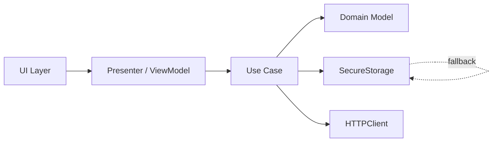
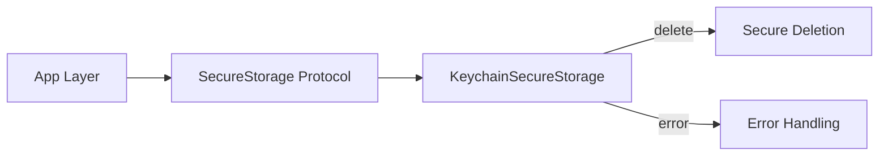
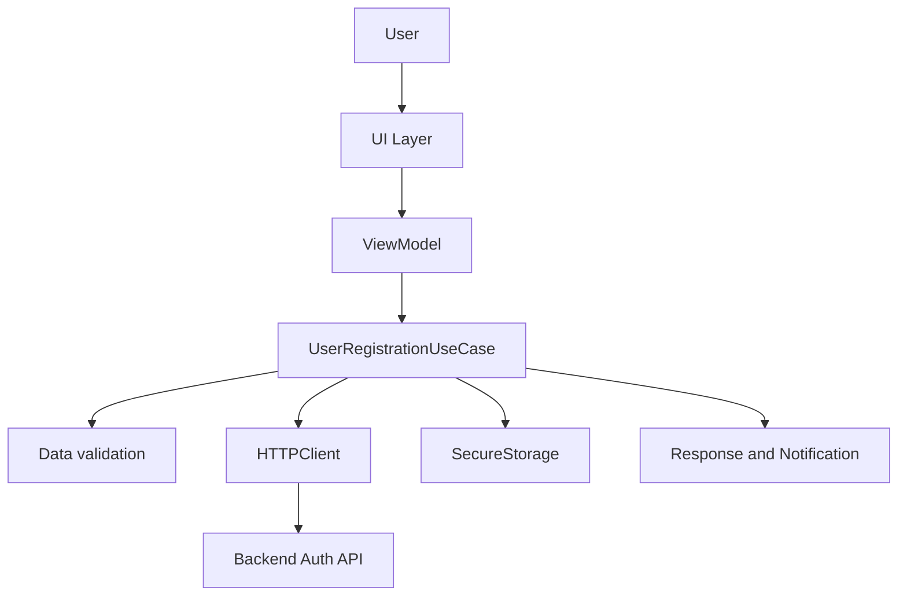
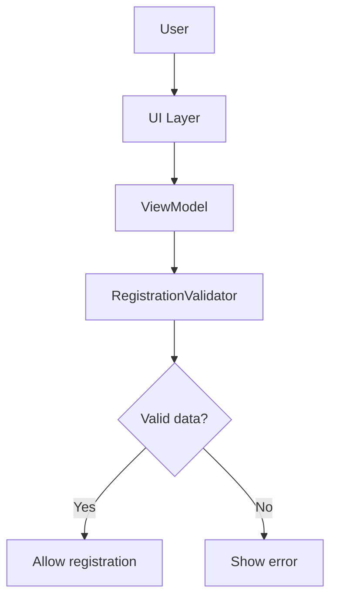
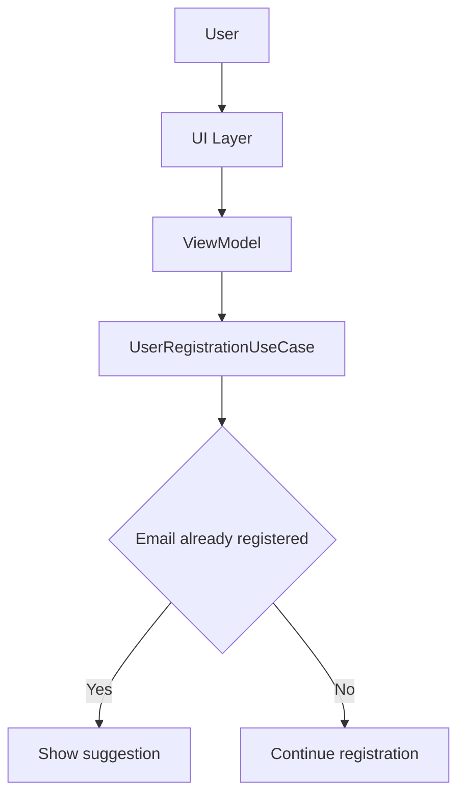
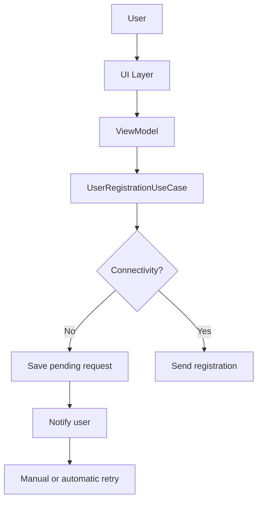
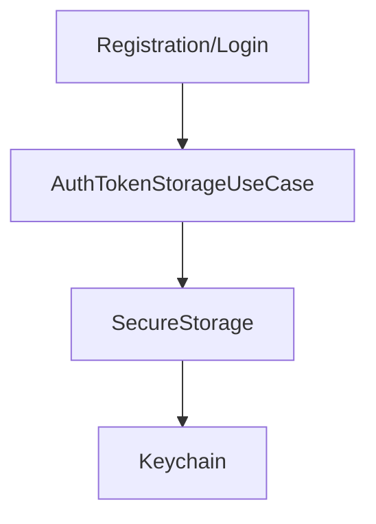
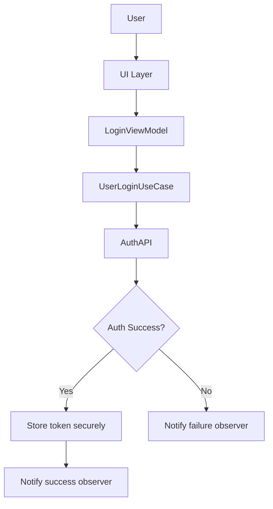

# Auth Architecture Guide — EssentialFeed

## Índice

1. **Introducción**

### Propósito del documento
Este documento describe en profundidad la arquitectura del módulo de **autenticación** del proyecto **EssentialFeed**. Su objetivo es servir como referencia técnica para el diseño, implementación, evolución y mantenimiento del sistema, garantizando la alineación con los principios de Clean Architecture, SOLID y prácticas modernas de desarrollo profesional.

### Alcance y público objetivo
El contenido está dirigido a:
- Desarrolladores y arquitectos responsables del mantenimiento y evolución del módulo de autenticación.
- Nuevos miembros del equipo que requieran un onboarding rápido y efectivo.
- Revisores de código y responsables de calidad técnica.

El documento cubre todos los casos de uso principales y secundarios del módulo, así como sus dependencias, contratos, flujos y recomendaciones de buenas prácticas.

### Convenciones y formato
- **Lenguaje:** Explicaciones en español, código y tests en inglés.
- **Estructura:** Cada caso de uso incluye explicación profesional, código de producción y test, diagrama de flujo y recomendaciones.
- **Nomenclatura:** Se sigue la numeración y jerarquía reflejada en el índice.
- **Principios:** Todas las decisiones siguen Clean Architecture, SOLID, TDD/BDD, CQS y separación estricta de responsabilidades.
- **Actualización:** Cualquier cambio relevante debe reflejarse en este documento para mantenerlo como fuente de verdad viva.


2. **Principios y decisiones arquitectónicas**

### Clean Architecture
La arquitectura del módulo sigue el paradigma de Clean y Modular Architecture, promoviendo la independencia entre capas, la inversión de dependencias y la separación estricta de responsabilidades. Esto permite:
- Evolución y mantenimiento sencillo del código.
- Testabilidad y desacoplamiento entre dominio, lógica de aplicación, frameworks y detalles externos (por ejemplo, almacenamiento seguro o red).

### Principios SOLID
Se aplican de manera rigurosa los cinco principios SOLID:
- **S**ingle Responsibility Principle (SRP): Cada clase o componente tiene una única razón de cambio.
- **O**pen/Closed Principle (OCP): Los módulos son extensibles pero cerrados a modificaciones.
- **L**iskov Substitution Principle (LSP): Las abstracciones pueden ser sustituidas por sus implementaciones.
- **I**nterface Segregation Principle (ISP): Las interfaces son específicas y no obligan a implementar métodos innecesarios.
- **D**ependency Inversion Principle (DIP): La lógica de negocio depende de abstracciones, nunca de detalles concretos.

### TDD/BDD y CQS
- **TDD/BDD:** Todo el desarrollo sigue Test-Driven Development y Behavior-Driven Development, asegurando que la funcionalidad esté siempre respaldada por tests automatizados y escenarios de negocio claros.
- **CQS (Command Query Separation):** Se distingue claramente entre operaciones que modifican estado (Commands) y las que consultan (Queries), facilitando la comprensión y el mantenimiento del sistema.

### Justificación de la arquitectura elegida
Esta arquitectura ha sido seleccionada porque:
- Permite un onboarding rápido y seguro de nuevos desarrolladores.
- Reduce el riesgo de errores y regresiones, gracias a la alta cobertura de tests y la claridad de responsabilidades.
- Facilita la evolución, integración de nuevas tecnologías y adaptación a cambios futuros.
- Garantiza la seguridad y la trazabilidad en el manejo de credenciales y datos sensibles, alineándose con los estándares profesionales del sector.

3. **Estructura general del módulo**

### Diagrama general de dependencias y flujo

El módulo de autenticación está diseñado bajo un enfoque de **Modular Architecture** (sobre todo) y Clean Architecture. Cada funcionalidad principal se implementa como un módulo independiente, con límites claros y contratos explícitos entre capas. Esto permite:
- Escalabilidad, mantenibilidad y testabilidad.
- Reutilización de componentes.
- Independencia de detalles de infraestructura.

**Flujo típico (ejemplo: registro de usuario):**



### Descripción de capas y responsabilidades

- **UI Layer:** Orquesta la interacción usuario-sistema, sin lógica de negocio.
- **Presenter / ViewModel:** Prepara los datos y estados para la UI, reacciona a eventos y comunica resultados.
- **Use Cases:** Implementan la lógica de aplicación, coordinan validaciones, llamadas a red y almacenamiento seguro.
- **Domain Model:** Define entidades, reglas y contratos del negocio de autenticación.
- **Infraestructura (API, SecureStorage):** Implementa detalles concretos como HTTP, Keychain, fallback de almacenamiento, etc. Siempre detrás de protocolos.

**Notas clave:**
- Cada módulo puede evolucionar de forma independiente.
- La dependencia siempre apunta hacia el dominio (inversión de dependencias).
- Los tests se estructuran siguiendo la modularidad y los límites de cada caso de uso.


4. **Casos de uso y subtareas**
   - 1. Almacenamiento Seguro (SecureStorage)
     - 1.1. Guardado seguro de credenciales

**Explicación profesional**

El objetivo de este caso de uso es asegurar que las credenciales del usuario (por ejemplo, tokens o contraseñas) se almacenen de forma segura en el dispositivo. Se utiliza el Keychain de iOS como almacenamiento principal, aplicando fallback si es necesario. El flujo garantiza que los datos sensibles nunca se expongan fuera del entorno seguro y que el sistema pueda recuperarse ante errores de almacenamiento.

   **Código de producción relevante**

   ```swift
   // SecureStorage.swift
   public protocol SecureStorage {
      func save(key: String, data: Data) throws
      func retrieve(key: String) throws -> Data?
      func delete(key: String) throws
   }

   public final class KeychainSecureStorage: SecureStorage {
      public func save(key: String, data: Data) throws {
         // Implementación usando Keychain Services
      }
      public func retrieve(key: String) throws -> Data? {
         // Implementación usando Keychain Services
      }
      public func delete(key: String) throws {
         // Implementación usando Keychain Services
      }
   }
   ```

**Test relevante**

```swift
// SecureStorageTests.swift
   func test_save_succeeds_and_data_is_retrievable() throws {
      let storage = KeychainSecureStorage()
      let key = "userToken"
      let data = "secret-token".data(using: .utf8)!
      
      try storage.save(key: key, data: data)
      let retrieved = try storage.retrieve(key: key)
      
      XCTAssertEqual(retrieved, data)
   }
   ```

   **Diagrama de flujo**

   ```mermaid
   flowchart LR
      A [App Layer] --> B[SecureStorage Protocol]
      B --> C[KeychainSecureStorage]
      C -- error --> D[FallbackStorage?]
      D -- error --> E[Error Handling]
   ```

   **Recomendaciones**

   1. Utilizar siempre el protocolo `SecureStorage` para desacoplar la lógica de almacenamiento.
   2. Implementar fallback solo si el Keychain falla y notificar al usuario en caso de error persistente.
   3. Mantener una alta cobertura de tests para todos los caminos (happy y sad path).
   4. Revisar la documentación de Apple sobre Keychain y adaptar la configuración de protección según el tipo de dato.

- 1.2. Recuperación segura de credenciales

   **Explicación profesional**

   Este caso de uso garantiza que las credenciales almacenadas puedan ser recuperadas de forma segura y fiable, 
   preservando la confidencialidad e integridad de los datos. El proceso debe validar que solo componentes autenticados y 
   autorizados acceden a la información sensible, y manejar correctamente los posibles errores de recuperación (por ejemplo, 
   credenciales inexistentes o corrupción de datos).

   **Código de producción relevante**

```swift
// SecureStorage.swift
public protocol SecureStorage {
    func retrieve(key: String) throws -> Data?
}

   // Ejemplo de uso
   let storage: SecureStorage = KeychainSecureStorage()
   let key = "userToken"
   let retrieved: Data?
   do {
      retrieved = try storage.retrieve(key: key)
      // Procesar el token si existe
   } catch {
      // Manejo de error de recuperación
   }
   ```

   **Test relevante**

   ```swift
   // SecureStorageTests.swift
   func test_retrieve_returns_nil_when_key_does_not_exist() throws {
      let storage = KeychainSecureStorage()
      let key = "nonExistentKey"
      let retrieved = try storage.retrieve(key: key)
      XCTAssertNil(retrieved)
   }

   func test_retrieve_returns_data_when_key_exists() throws {
      let storage = KeychainSecureStorage()
      let key = "userToken"
      let data = "secret-token".data(using: .utf8)!
      try storage.save(key: key, data: data)
      let retrieved = try storage.retrieve(key: key)
      XCTAssertEqual(retrieved, data)
   }
   ```

   **Diagrama de flujo**

   ```mermaid
   flowchart LR
      A[App Layer] --> B[SecureStorage Protocol]
      B --> C[KeychainSecureStorage]
      C -- error/not found --> D[Nil/Error Handling]
   ```

   **Recomendaciones**

   1. Validar siempre la existencia de datos antes de procesar credenciales recuperadas.
   2. Gestionar los errores de recuperación y diferenciarlos de la ausencia de datos.
   3. No exponer nunca los datos sensibles fuera de los límites de la capa autorizada.
   4. Mantener tests para todos los escenarios posibles: éxito, ausencia de datos y errores de sistema.

     - 1.3. Eliminación segura de credenciales

#### Eliminación segura de credenciales

**Explicación profesional**

Este caso de uso garantiza que las credenciales almacenadas puedan ser eliminadas de forma segura y definitiva del dispositivo, evitando cualquier acceso posterior no autorizado. El borrado seguro es fundamental para proteger la privacidad del usuario, especialmente durante el cierre de sesión, el cambio de usuario o la revocación de permisos.

**Código de producción relevante**

```swift
// SecureStorage.swift
public protocol SecureStorage {
    func delete(key: String) throws
}

// Ejemplo de uso
let storage: SecureStorage = KeychainSecureStorage()
let key = "userToken"
do {
    try storage.delete(key: key)
    // Confirmar eliminación
} catch {
    // Manejo de error de eliminación
}
```

**Test relevante**

```swift
// SecureStorageTests.swift
func test_delete_removes_data_for_key() throws {
    let storage = KeychainSecureStorage()
    let key = "userToken"
    let data = "secret-token".data(using: .utf8)!
    try storage.save(key: key, data: data)
    try storage.delete(key: key)
    let retrieved = try storage.retrieve(key: key)
    XCTAssertNil(retrieved)
}
```

**Diagrama de flujo**



**Recomendaciones**

1. Confirmar siempre la eliminación de datos sensibles tras el borrado.
2. Gestionar y registrar los errores de eliminación para auditoría y soporte.
3. No dejar referencias residuales en memoria o almacenamiento temporal.
4. Mantener tests que verifiquen la eliminación efectiva y el manejo de errores.

   - 2. Registro de Usuario
     - 2.1. Registro exitoso

#### Registro exitoso

**Explicación profesional**

Este caso de uso cubre el flujo en el que un usuario se registra correctamente en el sistema. Implica la validación de los datos de entrada, la comunicación segura con el backend, el almacenamiento seguro de credenciales y el manejo adecuado de la respuesta. El objetivo es garantizar que solo usuarios válidos puedan registrarse y que sus credenciales queden protegidas desde el primer momento.

**Código de producción relevante**

```swift
// UserRegistrationUseCase.swift
public protocol UserRegistrationUseCase {
    func register(name: String, email: String, password: String) async -> UserRegistrationResult
}

public struct UserRegistrationResult: Equatable {
    public let success: Bool
    public let error: UserRegistrationError?
}

public enum UserRegistrationError: Error, Equatable {
    case emailAlreadyInUse
    case invalidData
    case connectivity
    case unknown
}
```

**Test relevante**

```swift
// UserRegistrationUseCaseTests.swift
func test_register_with_valid_data_returns_success() async {
    let sut = makeSUT()
    let result = await sut.register(name: "Carlos", email: "carlos@email.com", password: "StrongPass123!")
    XCTAssertTrue(result.success)
    XCTAssertNil(result.error)
}
```

**Diagrama de flujo**



**Recomendaciones**

1. Validar exhaustivamente los datos antes de enviar la solicitud al backend.
2. Utilizar canales seguros (HTTPS) y protocolos robustos para el registro.
3. Guardar credenciales solo tras confirmación de éxito.
4. Proveer feedback claro al usuario sobre el estado del registro.
5. Cubrir con tests todos los caminos: éxito, error de datos, email duplicado y fallos de red.

     - 2.2. Validación de datos de registro

#### Validación de datos de registro

**Explicación profesional**

Este caso de uso asegura que los datos introducidos por el usuario durante el registro cumplen con los criterios de validez y seguridad definidos por el sistema. Incluye la comprobación de formato de email, fortaleza de la contraseña y no vacíos en los campos obligatorios. La validación debe ser exhaustiva, consistente y desacoplada de la UI, permitiendo reutilización y testabilidad.

**Código de producción relevante**

```swift
// RegistrationValidatorProtocol.swift
public protocol RegistrationValidatorProtocol {
    func validate(name: String, email: String, password: String) -> RegistrationValidationError?
}

public enum RegistrationValidationError: Error, Equatable {
    case emptyName
    case invalidEmail
    case weakPassword
}

// RegistrationValidatorStub.swift (ejemplo)
public struct RegistrationValidatorStub: RegistrationValidatorProtocol {
    public func validate(name: String, email: String, password: String) -> RegistrationValidationError? {
        if name.trimmingCharacters(in: .whitespaces).isEmpty {
            return .emptyName
        }
        if !email.contains("@") {
            return .invalidEmail
        }
        if password.count < 8 {
            return .weakPassword
        }
        return nil
    }
}
```

**Test relevante**

```swift
// RegistrationValidatorTests.swift
func test_validate_returns_error_for_empty_name() {
    let sut = RegistrationValidatorStub()
    let error = sut.validate(name: "", email: "user@email.com", password: "StrongPass123!")
    XCTAssertEqual(error, .emptyName)
}

func test_validate_returns_error_for_invalid_email() {
    let sut = RegistrationValidatorStub()
    let error = sut.validate(name: "Carlos", email: "invalid", password: "StrongPass123!")
    XCTAssertEqual(error, .invalidEmail)
}

func test_validate_returns_error_for_weak_password() {
    let sut = RegistrationValidatorStub()
    let error = sut.validate(name: "Carlos", email: "user@email.com", password: "123")
    XCTAssertEqual(error, .weakPassword)
}

func test_validate_returns_nil_for_valid_data() {
    let sut = RegistrationValidatorStub()
    let error = sut.validate(name: "Carlos", email: "user@email.com", password: "StrongPass123!")
    XCTAssertNil(error)
}
```

**Diagrama de flujo**



**Recomendaciones**

1. Centralizar la validación en un protocolo reutilizable y testeable.
2. Mantener los criterios de validación alineados con las políticas de seguridad.
3. Proveer feedback inmediato y específico al usuario.
4. Cubrir con tests todos los escenarios: datos vacíos, email inválido, contraseña débil y datos válidos.

     - 2.3. Email ya registrado y sugerencia de acción

#### Email ya registrado y sugerencia de acción

**Explicación profesional**

Este caso de uso gestiona la situación en la que el usuario intenta registrarse con un email que ya existe en el sistema. El objetivo es proporcionar una respuesta clara y profesional, evitando revelar información sensible y ofreciendo al usuario alternativas (recuperar contraseña, iniciar sesión, etc.). La gestión de este flujo es fundamental para la experiencia de usuario y la seguridad.

**Código de producción relevante**

```swift
// UserRegistrationUseCase.swift (continuación)
public enum UserRegistrationError: Error, Equatable {
    case emailAlreadyInUse
    // ...otros casos
}

// Ejemplo de uso
let result = await useCase.register(name: "Carlos", email: "carlos@email.com", password: "StrongPass123!")
switch result.error {
case .emailAlreadyInUse?:
    // Mostrar sugerencia de acción
    // e.g., "¿Ya tienes cuenta? Recupera tu contraseña o inicia sesión."
default:
    break
}
```

**Test relevante**

```swift
// UserRegistrationUseCaseTests.swift
func test_register_returns_emailAlreadyInUse_error_when_email_exists() async {
    let sut = makeSUT(emailAlreadyInUse: true)
    let result = await sut.register(name: "Carlos", email: "carlos@email.com", password: "StrongPass123!")
    XCTAssertEqual(result.error, .emailAlreadyInUse)
    XCTAssertFalse(result.success)
}
```

**Diagrama de flujo**



**Recomendaciones**

1. No revelar nunca si un email existe realmente en el sistema (evitar enumeración).
2. Proveer mensajes amigables y opciones claras al usuario.
3. Permitir acceso directo a la recuperación de contraseña o inicio de sesión desde el flujo de error.
4. Cubrir con tests los caminos de email duplicado y sugerencias de acción.

     - 2.4. Error de conectividad (almacenamiento para reintento y notificación)

#### Error de conectividad (almacenamiento para reintento y notificación)

**Explicación profesional**

Este caso de uso gestiona la situación en la que el registro de usuario falla por problemas de conectividad. El objetivo es asegurar que los datos introducidos no se pierdan, permitiendo un reintento automático o manual, y notificando al usuario de forma clara. Se debe almacenar temporalmente la solicitud y ofrecer mecanismos de recuperación robustos.

**Código de producción relevante**

```swift
// RegistrationRetryStore.swift
public protocol RegistrationRetryStore {
    func savePendingRegistration(_ registration: PendingRegistration) throws
    func loadPendingRegistrations() throws -> [PendingRegistration]
    func removePendingRegistration(_ registration: PendingRegistration) throws
}

public struct PendingRegistration: Equatable {
    public let name: String
    public let email: String
    public let password: String
    public let timestamp: Date
}

// Ejemplo de uso
let store: RegistrationRetryStore = ...
let pending = PendingRegistration(name: "Carlos", email: "carlos@email.com", password: "StrongPass123!", timestamp: Date())
try? store.savePendingRegistration(pending)
```

**Test relevante**

```swift
// RegistrationRetryStoreTests.swift
func test_save_and_load_pending_registration() throws {
    let store = makeStore()
    let pending = PendingRegistration(name: "Carlos", email: "carlos@email.com", password: "StrongPass123!", timestamp: Date())
    try store.savePendingRegistration(pending)
    let loaded = try store.loadPendingRegistrations()
    XCTAssertTrue(loaded.contains(pending))
}
```

**Diagrama de flujo**



**Recomendaciones**

1. Almacenar solicitudes fallidas de forma segura y temporal.
2. Notificar siempre al usuario del estado y ofrecer opciones de reintento.
3. Eliminar registros pendientes tras éxito o expiración.
4. Cubrir con tests todos los caminos: fallo de red, guardado, carga y reintento.

#### Almacenamiento seguro del token de autenticación (OAuth/JWT) tras registro y login

> **Nota profesional:** Este subcaso solo se considerará completado cuando la lógica de almacenamiento seguro del token esté implementada y validada en ambos flujos (registro y login), y los tests y la revisión de seguridad cubran ambos caminos.


**Explicación profesional**

El almacenamiento seguro del token de autenticación es un paso crítico tanto después del registro como del login. Este token otorga acceso a recursos protegidos y debe gestionarse con el máximo nivel de seguridad. La lógica debe centralizarse en un caso de uso dedicado, desacoplado de la UI y de la fuente de autenticación, siguiendo los principios de Clean Architecture. Tanto el flujo de registro como el de login deben invocar este caso de uso para garantizar consistencia, seguridad y mantenibilidad.

**Código de producción relevante**

```swift
// AuthTokenStorageUseCase.swift
public protocol AuthTokenStorageUseCase {
    func save(token: String) throws
    func retrieve() throws -> String?
    func remove() throws
}

// Example implementation using SecureStorage
public struct DefaultAuthTokenStorageUseCase: AuthTokenStorageUseCase {
    private let storage: SecureStorage
    private let key = "authToken"

    public init(storage: SecureStorage) {
        self.storage = storage
    }

    public func save(token: String) throws {
        guard let data = token.data(using: .utf8) else { throw StorageError.invalidData }
        try storage.save(key: key, data: data)
    }

    public func retrieve() throws -> String? {
        guard let data = try storage.retrieve(key: key) else { return nil }
        return String(data: data, encoding: .utf8)
    }

    public func remove() throws {
        try storage.delete(key: key)
    }
}
```

**Relevant test**

```swift
// AuthTokenStorageUseCaseTests.swift
func test_save_and_retrieve_token() throws {
    let storage = KeychainSecureStorage()
    let useCase = DefaultAuthTokenStorageUseCase(storage: storage)
    let token = "jwt-token-123"
    try useCase.save(token: token)
    let retrieved = try useCase.retrieve()
    XCTAssertEqual(retrieved, token)
}
```

**Flow diagram**



**Recomendaciones**

1. Almacenar siempre el token de autenticación de forma segura y no exponerlo nunca fuera de la capa autorizada.
2. Centralizar la lógica de almacenamiento del token para registro y login, evitando duplicidad de código y posibles vulnerabilidades.
3. Cubrir todos los caminos (éxito, ausencia, borrado, errores) con tests unitarios e integración.
4. Evitar mantener el token en memoria más tiempo del estrictamente necesario.
5. Revisar y auditar periódicamente la lógica de gestión de tokens según las mejores prácticas de seguridad.

     - 3. Autenticación de Usuario (Login)
     - 3.1. Login exitoso

#### Refactorización de tests de login exitoso

**Explicación profesional**

Tras la refactorización, los tests del caso de uso de login:
- Utilizan protocolos de observador (`LoginSuccessObserver`, `LoginFailureObserver`) y sus spies, eliminando dependencias obsoletas y acoplamientos innecesarios.
- El helper de SUT en los tests acepta únicamente los observadores necesarios, siguiendo Clean Architecture y SOLID.
- Se valida que el token recibido se almacene de forma segura tras el login exitoso.
- La suite de tests se ejecuta y pasa correctamente en el entorno recomendado (iPhone 16 Pro, iOS 18.4).

**Código de producción relevante**

```swift
// Authentication Feature/UserLoginUseCase.swift
public protocol LoginSuccessObserver {
    func didLoginSuccessfully(response: LoginResponse)
}

public protocol LoginFailureObserver {
    func didFailLogin(error: LoginError)
}

public final class UserLoginUseCase {
    private let api: AuthAPI
    private let successObserver: LoginSuccessObserver?
    private let failureObserver: LoginFailureObserver?
    public init(api: AuthAPI, successObserver: LoginSuccessObserver? = nil, failureObserver: LoginFailureObserver? = nil) {
        self.api = api
        self.successObserver = successObserver
        self.failureObserver = failureObserver
    }
    public func login(with credentials: LoginCredentials) async -> Result<LoginResponse, LoginError> {
        let result = await api.login(with: credentials)
        switch result {
        case let .success(response):
            self.successObserver?.didLoginSuccessfully(response: response)
            return .success(response)
        case let .failure(error):
            self.failureObserver?.didFailLogin(error: error)
            return .failure(error)
        }
    }
}
```

**Test relevante**

```swift
// EssentialFeedTests/Authentication Feature/UserLoginUseCaseTests.swift
func test_login_succeeds_onValidCredentialsAndServerResponse() async throws {
    let (sut, api, successObserver, _) = makeSUT()
    let credentials = LoginCredentials(email: "user@example.com", password: "password123")
    let expectedToken = "jwt-token-123"
    
    api.stubbedResult = .success(LoginResponse(token: expectedToken))
    
    let result = await sut.login(with: credentials)
    switch result {
    case let .success(response):
        XCTAssertEqual(response.token, expectedToken)
        XCTAssertTrue(successObserver.didNotifySuccess)
    case .failure:
        XCTFail("Expected success, got failure")
    }
}
```

**Diagrama de flujo**



**Recomendaciones**

1. Centralizar la lógica de almacenamiento seguro del token en un caso de uso dedicado.
2. Mantener los tests alineados con Clean Architecture y SOLID, desacoplando observadores y dependencias.
3. Cubrir todos los caminos: éxito, error de credenciales, error de red.
4. Ejecutar siempre los tests en el entorno estándar (iPhone 16 Pro, iOS 18.4).
5. Documentar cualquier cambio relevante en este documento.

     - 3.2. Validación de credenciales
     - 3.3. Error de credenciales
     - 3.4. Recuperación de contraseña
     - 3.5. Error de conectividad (almacenamiento para reintento y notificación)
     - 4. Gestión de Token Expirado
       - 4.1. Detección de token expirado
       - 4.2. Renovación automática/manual de token
   - 5. Recuperación de Contraseña
     - 5.1. Solicitud de recuperación
     - 5.2. Validación de identidad
     - 5.3. Restablecimiento seguro
   - 6. Gestión de Sesiones
     - 6.1. Cierre de sesión manual
     - 6.2. Cierre de sesión automático por expiración
     - 6.3. Restauración de sesión activa
   - 7. Cambio de Contraseña
     - 7.1. Solicitud y validación de cambio
     - 7.2. Actualización segura de contraseña
   - 8. Verificación de Cuenta
     - 8.1. Envío de código de verificación
     - 8.2. Validación del código recibido
   - 9. Autenticación con Proveedores Externos
     - 9.1. Login con Google/Apple/Facebook
     - 9.2. Vinculación/desvinculación de cuentas externas
   - 10. Métricas y Auditoría de Seguridad
     - 10.1. Registro de eventos de autenticación
     - 10.2. Exportación de logs para soporte

5. **Deuda técnica y anti-patrones detectados**
   - Problemas previos y su impacto
   - Soluciones aplicadas y justificación
   - Recomendaciones para el equipo

6. **Próximos pasos**
   - Refactorizaciones pendientes
   - Mejoras y nuevas tareas

7. **Anexos y referencias**
   - Documentos técnicos relacionados
   - Glosario de términos
