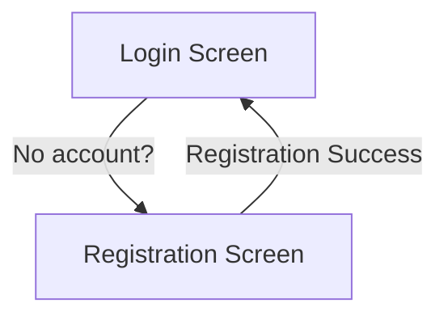

# Essential App Case Study

## Architectural Decision: Composer vs Coordinator

**Note:** This proof-of-concept project centralizes navigation in the Composer to keep things simple and to focus on practicing Clean Architecture, modularization, and TDD.

- **Advantage:** Allows for experimentation and learning without overengineering.
- **Limitation:** If the app grows significantly, the Composer can become a "God Object," making scalability and maintenance more difficult.

**Professional recommendation:**
- For real and scalable projects, migrate to a Coordinator pattern, with one Coordinator per feature or flow, to achieve loose coupling, high cohesion, and true modularization.
- Document this decision and apply the Coordinator pattern from the start in ambitious projects.

---

If you have questions about migrating to Coordinators or want a reference demo, check the internal documentation or contact the architecture team.

---

## Current State
- Navigation is centralized in the Composer.
- Features are decoupled and testable.
- Modularization and Clean Code are applied in every feature.

---

## Authentication Flow: Registration & Login

### Overview

The authentication flow consists of two independent use cases: **User Registration** and **User Login**. Each use case is fully decoupled and follows Clean Architecture principles, with its own technical checklist and acceptance criteria.

- **Registration**: Allows a new user to create an account and securely store credentials.
- **Login**: Allows a registered user to authenticate and access the app.

### Navigation Flow (UI Layer)

The navigation between Registration and Login is orchestrated by the Composer (or Coordinator, in scalable projects). This orchestration is not a business use case, but a UI responsibility. The flow is as follows:

1. **Initial State**: The user is presented with either the Login or Registration screen (depending on app requirements).
2. **From Registration to Login**:
   - After a successful registration, the user is navigated to the Login screen to authenticate with their new credentials.
3. **From Login to Registration**:
   - If the user does not have an account, they can navigate from the Login screen to the Registration screen.
4. **Error Handling**:
   - Specific error messages are shown for invalid credentials, email already in use, connectivity issues, etc., as defined in each use case checklist.

### Technical Notes

- **Composer Responsibility**: The Composer handles the presentation and navigation between Registration and Login, ensuring loose coupling and modularity.
- **No Domain Coupling**: Navigation logic is not part of the domain layer; it is purely a UI/infrastructure concern.
- **Documentation**: Each use case has its own technical checklist and acceptance criteria, as defined in the BDD-Security-Features document.

---

**Example Diagram:**



---

**Tip:** For scalable projects, consider migrating the navigation logic to a Coordinator pattern for even better modularity and testability.

---

## Key Documentation

- [BDD & Security Features](./EssentialFeed/BDD-Security-Features.md): Functional use cases and narrative
- [Technical Roadmap](./EssentialFeed/TECHNICAL-ROADMAP.md): Cross-cutting technical priorities and next steps

---

  

## Image Feed Feature Specs

### Story: Customer requests to see their image feed

### Narrative #1

```
As an online customer
I want the app to automatically load my latest image feed
So I can always enjoy the newest images of my friends
```

#### Scenarios (Acceptance criteria)

```
Given the customer has connectivity
 When the customer requests to see their feed
 Then the app should display the latest feed from remote
  And replace the cache with the new feed
```

### Narrative #2

```
As an offline customer
I want the app to show the latest saved version of my image feed
So I can always enjoy images of my friends
```

#### Scenarios (Acceptance criteria)

```
Given the customer doesn't have connectivity
  And there’s a cached version of the feed
 ## 🧪 Test Pattern for HTTPClient with URLProtocolStub

To ensure that `HTTPClient` integration tests are deterministic, fast, and do not depend on the real network, we use a network stub (`URLProtocolStub`) and a custom `URLSession` configuration.

**Why not use `.shared`?**
- Using `.shared` can cause interference between tests and accidental dependencies on the real network.
- Each test must be hermetic: full control over responses, with no side effects or external dependencies.

**Recommended pattern:**
```swift
private func makeSUT(
    session: URLSession? = nil,
    file: StaticString = #file,
    line: UInt = #line
) -> HTTPClient {
    let configuration = URLSessionConfiguration.ephemeral
    configuration.protocolClasses = [URLProtocolStub.self]
    let session = session ?? URLSession(configuration: configuration)
    let sut = URLSessionHTTPClient(session: session)
    trackForMemoryLeaks(sut, file: file, line: line)
    return sut as HTTPClient
}
```
- This way, all integration tests use the stub, avoiding the real network.
- If a test needs a special session, it can provide one.

**Advantages:**
- Fast, predictable, and flake-free tests.
- Full isolation of each test case.
- Facilitates TDD/BDD and confidence in the test suite.

> **Note:** This pattern is especially useful in modular projects, CI, and when there are concurrent tests.  
 And the cache is less than seven days old
 When the customer requests to see the feed
 Then the app should display the latest feed saved

Given the customer doesn't have connectivity
  And there’s a cached version of the feed
  And the cache is seven days old or more
 When the customer requests to see the feed
 Then the app should display an error message

Given the customer doesn't have connectivity
  And the cache is empty
 When the customer requests to see the feed
 Then the app should display an error message
```

## Use Cases

### Load Feed From Remote Use Case

#### Data:
- URL

#### Primary course (happy path):
1. Execute "Load Image Feed" command with above data.
2. System downloads data from the URL.
3. System validates downloaded data.
4. System creates image feed from valid data.
5. System delivers image feed.

#### Invalid data – error course (sad path):
1. System delivers invalid data error.

#### No connectivity – error course (sad path):
1. System delivers connectivity error.

---

### Load Feed Image Data From Remote Use Case

#### Data:
- URL

#### Primary course (happy path):
1. Execute "Load Image Data" command with above data.
2. System downloads data from the URL.
3. System validates downloaded data.
4. System delivers image data.

#### Cancel course:
1. System does not deliver image data nor error.

#### Invalid data – error course (sad path):
1. System delivers invalid data error.

#### No connectivity – error course (sad path):
1. System delivers connectivity error.

---

### Load Feed From Cache Use Case

#### Primary course:
1. Execute "Load Image Feed" command with above data.
2. System retrieves feed data from cache.
3. System validates cache is less than seven days old.
4. System creates image feed from cached data.
5. System delivers image feed.

#### Retrieval error course (sad path):
1. System delivers error.

#### Expired cache course (sad path): 
1. System delivers no feed images.

#### Empty cache course (sad path): 
1. System delivers no feed images.

---

### Load Feed Image Data From Cache Use Case

#### Data:
- URL

#### Primary course (happy path):
1. Execute "Load Image Data" command with above data.
2. System retrieves data from the cache.
3. System delivers cached image data.

#### Cancel course:
1. System does not deliver image data nor error.

#### Retrieval error course (sad path):
1. System delivers error.

#### Empty cache course (sad path):
1. System delivers not found error.

---

### Validate Feed Cache Use Case

#### Primary course:
1. Execute "Validate Cache" command with above data.
2. System retrieves feed data from cache.
3. System validates cache is less than seven days old.

#### Retrieval error course (sad path):
1. System deletes cache.

#### Expired cache course (sad path): 
1. System deletes cache.

---

### Cache Feed Use Case

#### Data:
- Image Feed

#### Primary course (happy path):
1. Execute "Save Image Feed" command with above data.
2. System deletes old cache data.
3. System encodes image feed.
4. System timestamps the new cache.
5. System saves new cache data.
6. System delivers success message.

#### Deleting error course (sad path):
1. System delivers error.

#### Saving error course (sad path):
1. System delivers error.

---

### Cache Feed Image Data Use Case

#### Data:
- Image Data

#### Primary course (happy path):
1. Execute "Save Image Data" command with above data.
2. System caches image data.
3. System delivers success message.

#### Saving error course (sad path):
1. System delivers error.

---

## Flowchart


## Model Specs

### Feed Image

| Property      | Type                |
|---------------|---------------------|
| `id`          | `UUID`              |
| `description` | `String` (optional) |
| `location`    | `String` (optional) |
| `url`	        | `URL`               |

### Payload contract

```
GET /feed

200 RESPONSE

{
	"items": [
		{
			"id": "a UUID",
			"description": "a description",
			"location": "a location",
			"image": "https://a-image.url",
		},
		{
			"id": "another UUID",
			"description": "another description",
			"image": "https://another-image.url"
		},
		{
			"id": "even another UUID",
			"location": "even another location",
			"image": "https://even-another-image.url"
		},
		{
			"id": "yet another UUID",
			"image": "https://yet-another-image.url"
		}
		...
	]
}
```

---

## Image Comments Feature Specs

### Story: Customer requests to see image comments

### Narrative

```
As an online customer
I want the app to load image commments
So I can see how people are engaging with images in my feed
```

#### Scenarios (Acceptance criteria)

```
Given the customer has connectivity
 When the customer requests to see comments on an image
 Then the app should display all comments for that image
```

```
Given the customer doesn't have connectivity
 When the customer requests to see comments on an image
 Then the app should display an error message
```

## Use Cases

### Load Image Comments From Remote Use Case

#### Data:
- ImageID

#### Primary course (happy path):
1. Execute "Load Image Comments" command with above data.
2. System loads data from remote service.
3. System validates data.
4. System creates comments from valid data.
5. System delivers comments.

#### Invalid data – error course (sad path):
1. System delivers invalid data error.

#### No connectivity – error course (sad path):
1. System delivers connectivity error.

---

## Model Specs

### Image Comment

| Property          | Type                    |
|-------------------|-------------------------|
| `id`              | `UUID`                  |
| `message` 	    | `String`			      |
| `created_at`      | `Date` (ISO8601 String) |
| `author` 			| `CommentAuthorObject`   |

### Image Comment Author

| Property          | Type                |
|-------------------|---------------------|
| `username` 	    | `String`			  |

### Payload contract

```
GET /image/{image-id}/comments

2xx RESPONSE

{
	"items": [
		{
			"id": "a UUID",
			"message": "a message",
			"created_at": "2020-05-20T11:24:59+0000",
			"author": {
				"username": "a username"
			}
		},
		{
			"id": "another UUID",
			"message": "another message",
			"created_at": "2020-05-19T14:23:53+0000",
			"author": {
				"username": "another username"
			}
		},
		...
	]
}
```

---

## App Architecture


<!-- COVERAGE-REPORT-START -->
# 📊 Code Coverage Summary

**Total coverage:** **91.39%**

---

## Files with Highest Coverage

| File | Coverage | Covered by Test |
|---|---|---|
| [UserLoginUseCase.swift](/Users/juancarlosmerlosalbarracin/Developer/Essential_Developer/essential-feed-case-study/EssentialFeed/Authentication Feature/UserLoginUseCase.swift) | 100.00% | UserLoginUseCaseTests.swift |
| [SecureStorage.swift](/Users/juancarlosmerlosalbarracin/Developer/Essential_Developer/essential-feed-case-study/EssentialFeed/Security Feature/SecureStorage.swift) | 100.00% | KeychainSecureStorageTests.swift
SystemKeychainIntegrationCoverageTests.swift
SecureStorageTests.swift |
| [UserRegistrationUseCase.swift](/Users/juancarlosmerlosalbarracin/Developer/Essential_Developer/essential-feed-case-study/EssentialFeed/EssentialFeed/Registration Feature/UserRegistrationUseCase.swift) | 97.46% | UserRegistrationUseCaseTests+Server.swift
UserRegistrationUseCaseTests.swift |
| [SystemKeychain.swift](/Users/juancarlosmerlosalbarracin/Developer/Essential_Developer/essential-feed-case-study/EssentialFeed/EssentialFeed/Security Feature/Keychain/SystemKeychain.swift) | 51.85% | SystemKeychainIntegrationCoverageTests.swift
SystemKeychainTests.swift
SecureStorageTests.swift |

## Files with Lower Coverage (>0%)

| File | Coverage | Covered by Test |
|---|---|---|
| [SystemKeychain.swift](/Users/juancarlosmerlosalbarracin/Developer/Essential_Developer/essential-feed-case-study/EssentialFeed/EssentialFeed/Security Feature/Keychain/SystemKeychain.swift) | 51.85% | SystemKeychainIntegrationCoverageTests.swift
SystemKeychainTests.swift
SecureStorageTests.swift |
| [UserRegistrationUseCase.swift](/Users/juancarlosmerlosalbarracin/Developer/Essential_Developer/essential-feed-case-study/EssentialFeed/EssentialFeed/Registration Feature/UserRegistrationUseCase.swift) | 97.46% | UserRegistrationUseCaseTests+Server.swift
UserRegistrationUseCaseTests.swift |
| [UserLoginUseCase.swift](/Users/juancarlosmerlosalbarracin/Developer/Essential_Developer/essential-feed-case-study/EssentialFeed/Authentication Feature/UserLoginUseCase.swift) | 100.00% | UserLoginUseCaseTests.swift |
| [SecureStorage.swift](/Users/juancarlosmerlosalbarracin/Developer/Essential_Developer/essential-feed-case-study/EssentialFeed/Security Feature/SecureStorage.swift) | 100.00% | KeychainSecureStorageTests.swift
SystemKeychainIntegrationCoverageTests.swift
SecureStorageTests.swift |

---
## Production files **without any associated test**

All production files have at least one associated test.

> These files have no direct test associated according to the mapping by name and use case. Review if they require coverage or if they are candidates for refactoring.

### How to read this report?
- **Total coverage:** Percentage of lines covered by tests in the entire target.
- **Highest coverage:** Files best covered by tests.
- **Lowest coverage:** Files with the lowest coverage (but greater than 0%).

> For coverage by class or function, check the `coverage-report.txt` file.
<!-- COVERAGE-REPORT-END -->
