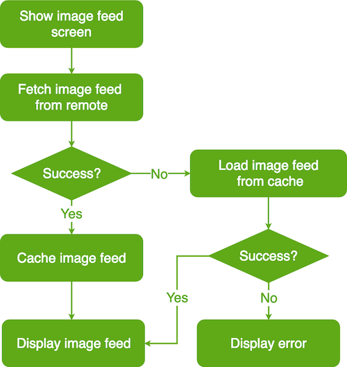
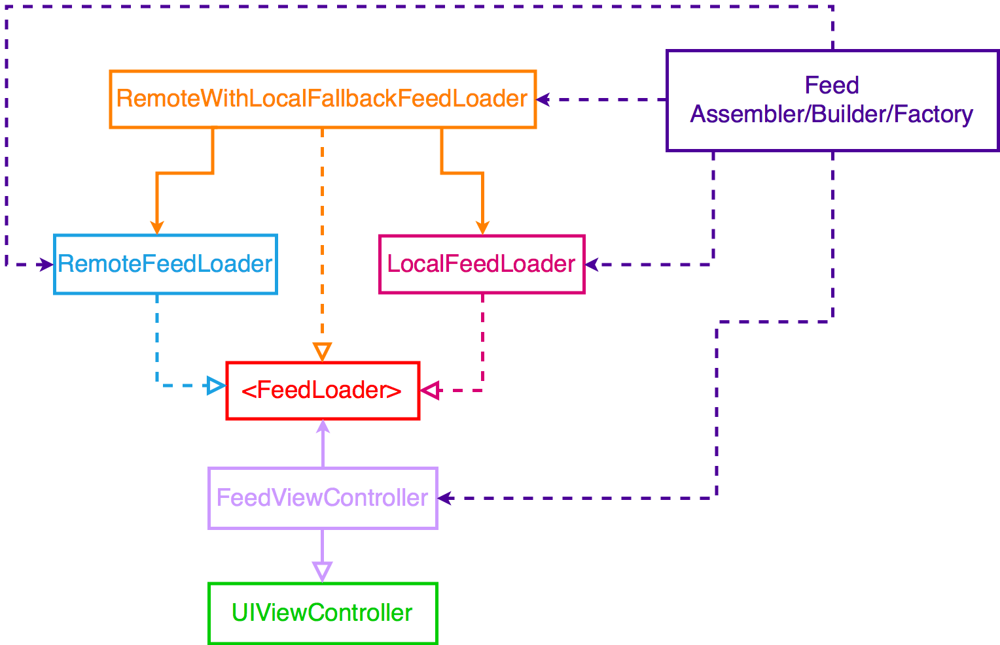

# Essential Feed App – Image Feed Feature

[](https://travis-ci.com/essentialdevelopercom/essential-feed-case-study)

## BDD Specs

### Story: Customer requests to see their image feed

### Narrative #1

```
As an online customer
I want the app to automatically load my latest image feed
So I can always enjoy the newest images of my friends
```

#### Scenarios (Acceptance criteria)

```
Given the customer has connectivity
 When the customer requests to see their feed
 Then the app should display the latest feed from remote
  And replace the cache with the new feed
```

### Narrative #2

```
As an offline customer
I want the app to show the latest saved version of my image feed
So I can always enjoy images of my friends
```

#### Scenarios (Acceptance criteria)

```
Given the customer doesn't have connectivity
  And there’s a cached version of the feed
  And the cache is less than seven days old
 When the customer requests to see the feed
 Then the app should display the latest feed saved

Given the customer doesn't have connectivity
  And there’s a cached version of the feed
  And the cache is seven days old or more
 When the customer requests to see the feed
 Then the app should display an error message

Given the customer doesn't have connectivity
  And the cache is empty
 When the customer requests to see the feed
 Then the app should display an error message
```

## Use Cases

### Load Feed From Remote Use Case

#### Data:
- URL

#### Primary course (happy path):
1. Execute "Load Image Feed" command with above data.
2. System downloads data from the URL.
3. System validates downloaded data.
4. System creates image feed from valid data.
5. System delivers image feed.

#### Invalid data – error course (sad path):
1. System delivers invalid data error.

#### No connectivity – error course (sad path):
1. System delivers connectivity error.

---

### Load Feed Image Data From Remote Use Case

#### Data:
- URL

#### Primary course (happy path):
1. Execute "Load Image Data" command with above data.
2. System downloads data from the URL.
3. System validates downloaded data.
4. System delivers image data.

#### Cancel course:
1. System does not deliver image data nor error.

#### Invalid data – error course (sad path):
1. System delivers invalid data error.

#### No connectivity – error course (sad path):
1. System delivers connectivity error.

---

### Load Feed From Cache Use Case

#### Primary course:
1. Execute "Load Image Feed" command with above data.
2. System retrieves feed data from cache.
3. System validates cache is less than seven days old.
4. System creates image feed from cached data.
5. System delivers image feed.

#### Retrieval error course (sad path):
1. System delivers error.

#### Expired cache course (sad path): 
1. System delivers no feed images.

#### Empty cache course (sad path): 
1. System delivers no feed images.

---

### Load Feed Image Data From Cache Use Case

#### Data:
- URL

#### Primary course (happy path):
1. Execute "Load Image Data" command with above data.
2. System retrieves data from the cache.
3. System delivers cached image data.

#### Cancel course:
1. System does not deliver image data nor error.

#### Retrieval error course (sad path):
1. System delivers error.

#### Empty cache course (sad path):
1. System delivers not found error.

---

### Validate Feed Cache Use Case

#### Primary course:
1. Execute "Validate Cache" command with above data.
2. System retrieves feed data from cache.
3. System validates cache is less than seven days old.

#### Retrieval error course (sad path):
1. System deletes cache.

#### Expired cache course (sad path): 
1. System deletes cache.

---

### Cache Feed Use Case

#### Data:
- Image Feed

#### Primary course (happy path):
1. Execute "Save Image Feed" command with above data.
2. System deletes old cache data.
3. System encodes image feed.
4. System timestamps the new cache.
5. System saves new cache data.
6. System delivers success message.

#### Deleting error course (sad path):
1. System delivers error.

#### Saving error course (sad path):
1. System delivers error.

---

### Cache Feed Image Data Use Case

#### Data:
- Image Data

#### Primary course (happy path):
1. Execute "Save Image Data" command with above data.
2. System caches image data.
3. System delivers success message.

#### Saving error course (sad path):
1. System delivers error.

---

## Flowchart



## Architecture



## Model Specs

### Feed Image

| Property      | Type                |
|---------------|---------------------|
| `id`          | `UUID`              |
| `description` | `String` (optional) |
| `location`    | `String` (optional) |
| `url`	        | `URL`               |

### Payload contract

```
GET *url* (TBD)

200 RESPONSE

{
	"items": [
		{
			"id": "a UUID",
			"description": "a description",
			"location": "a location",
			"image": "https://a-image.url",
		},
		{
			"id": "another UUID",
			"description": "another description",
			"image": "https://another-image.url"
		},
		{
			"id": "even another UUID",
			"location": "even another location",
			"image": "https://even-another-image.url"
		},
		{
			"id": "yet another UUID",
			"image": "https://yet-another-image.url"
		}
		...
	]
}
```
