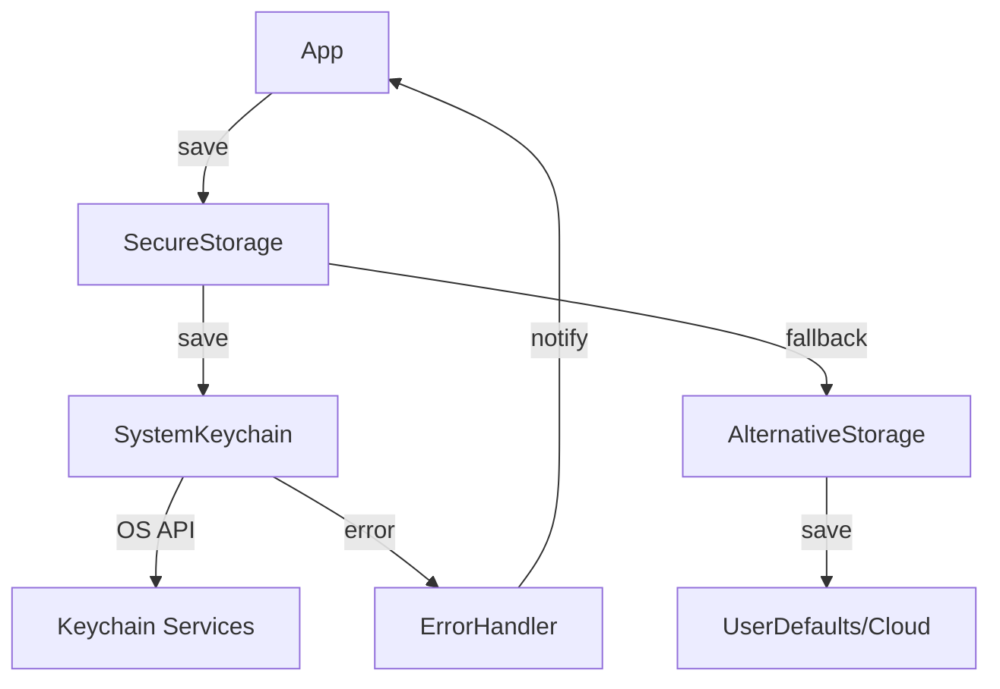
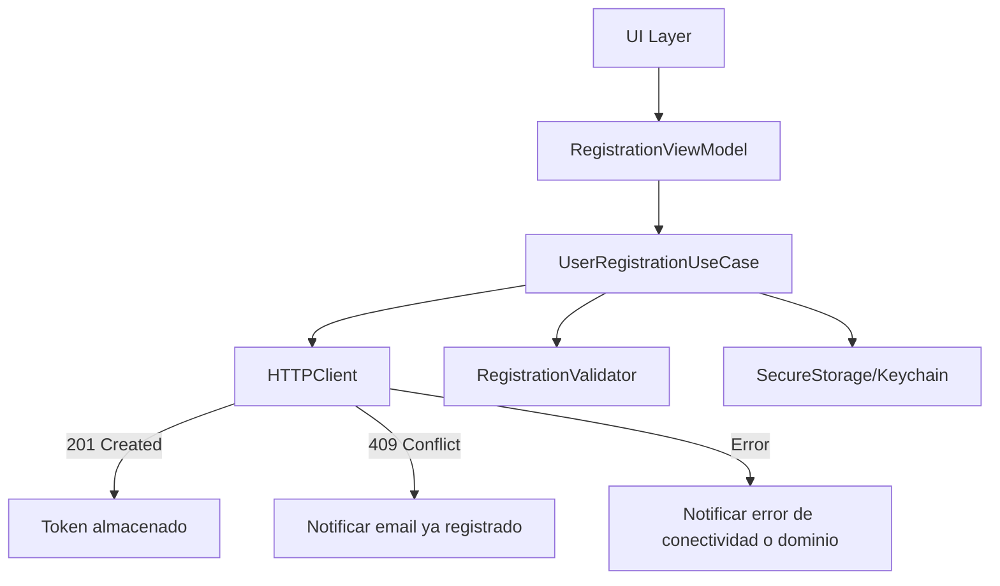
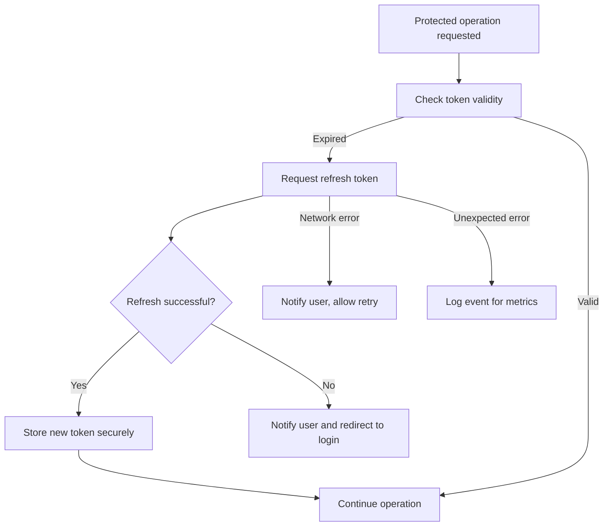
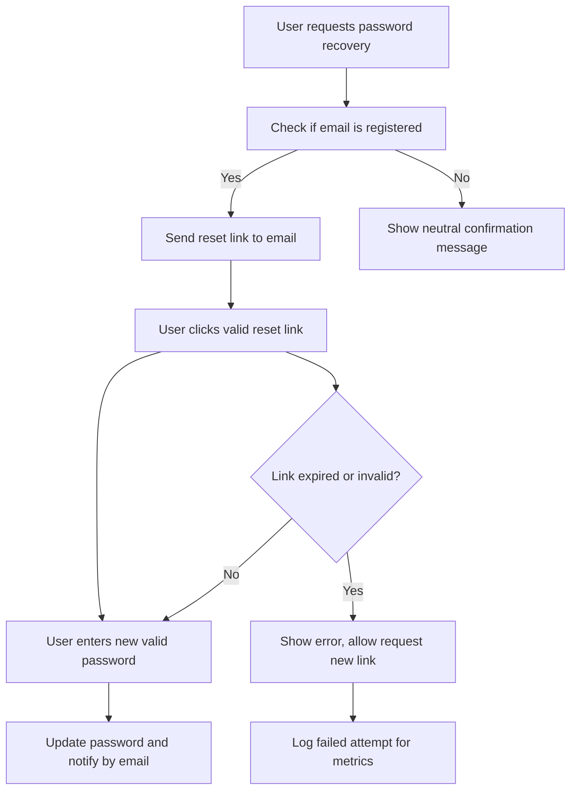
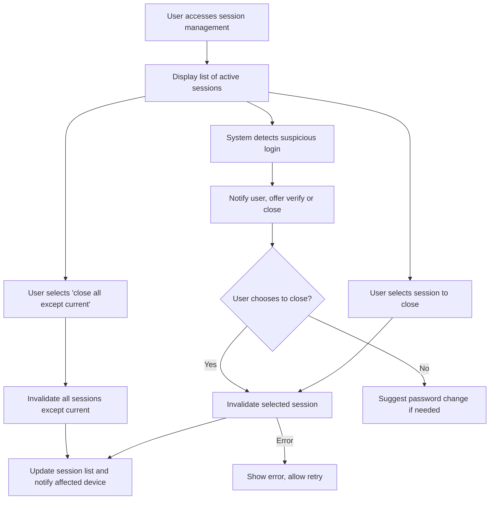
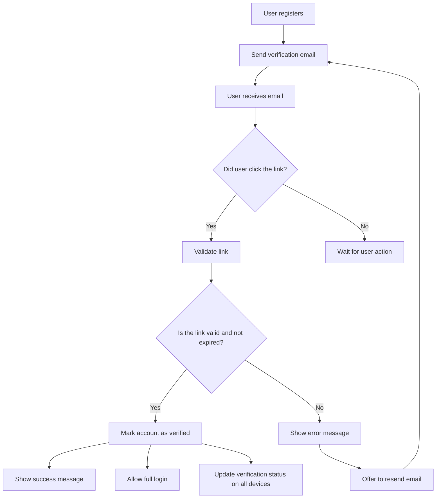
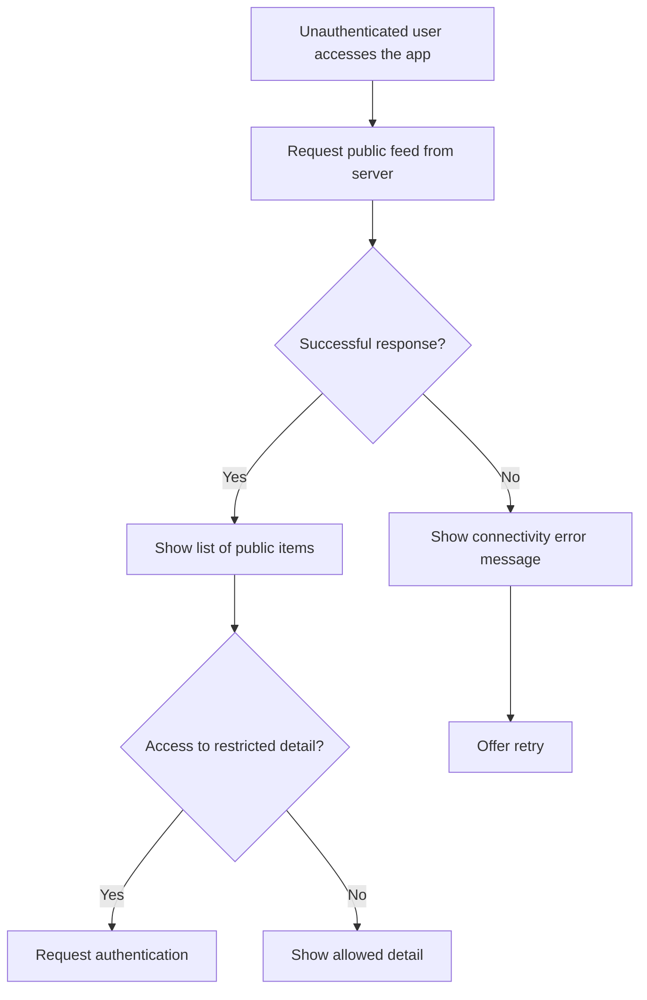
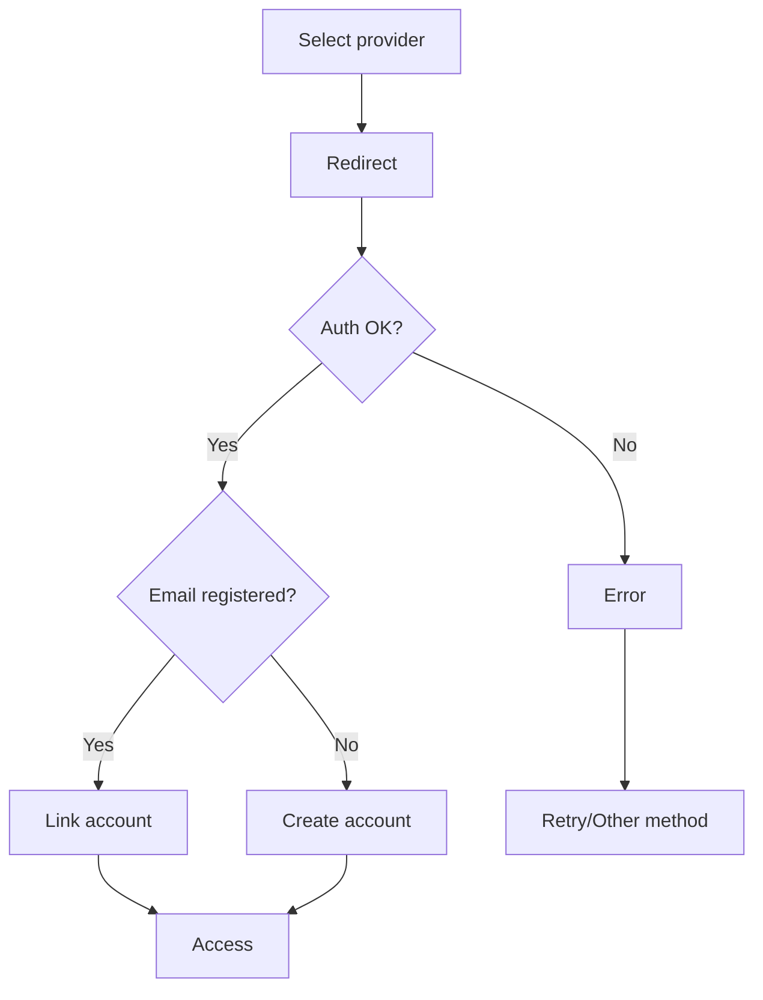
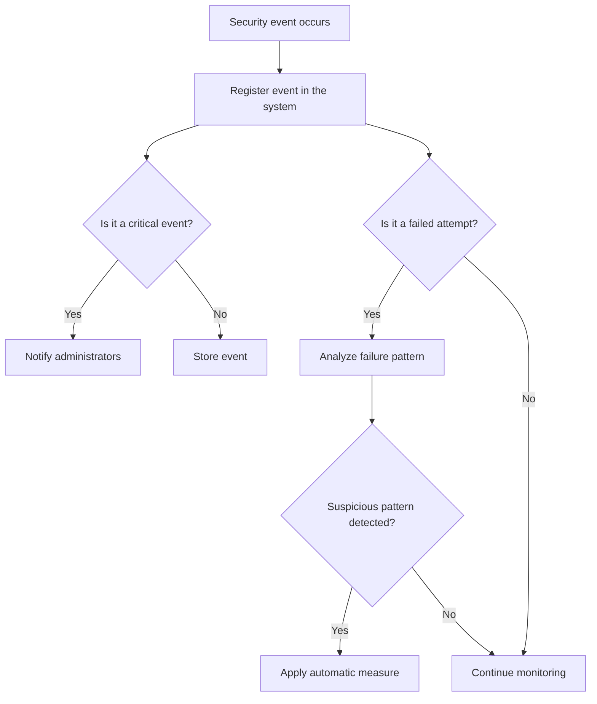

# Estado de Implementación

# Cómo usar este documento
- Utiliza este documento como guía para priorizar el desarrollo y los tests.
- Marca los escenarios como completados a medida que avances.
- Amplía los escenarios con ejemplos Gherkin si lo deseas (puedo ayudarte a generarlos).

## 🔐 Explicación técnica: Ciclo de vida y uso de tokens (JWT/OAuth)

- **Registro de usuario:** No requiere token en la petición. El backend devuelve un token tras el registro exitoso (si aplica), que debe almacenarse de forma segura (Keychain).
- **Login/autenticación:** No requiere token en la petición. El backend devuelve un token tras login exitoso, que debe almacenarse de forma segura.
- **Operaciones protegidas:** Todas las peticiones a endpoints protegidos (cambio de contraseña, actualización de perfil, acceso a recursos, etc) requieren que la app añada el token en la cabecera `Authorization: Bearer <token>`. El token se obtiene del almacenamiento seguro.
- **Expiración y renovación:** El token tiene un tiempo de vida limitado. Si expira, la app debe intentar renovarlo usando el refresh token. Si no es posible renovar, se fuerza al usuario a autenticarse de nuevo.
- **Peticiones públicas:** Registro, login y recuperación de contraseña (si es pública) no requieren token.

| Petición                   | ¿Requiere token? | ¿Almacena token? | ¿Usa refresh? |
|----------------------------|:----------------:|:----------------:|:-------------:|
| Registro                   |        ❌        |       ✅*        |      ❌       |
| Login                      |        ❌        |       ✅         |      ❌       |
| Cambio de contraseña       |        ✅        |       ❌         |      ❌       |
| Acceso a datos protegidos  |        ✅        |       ❌         |      ❌       |
| Refresh token              |        ✅        |       ✅         |      ✅       |
| Logout                     |      Depende     |       ❌         |      ❌       |

*El token se almacena solo si el backend lo devuelve tras el registro.

---

> **Nota profesional sobre tests de Keychain:**
> Para garantizar la fiabilidad y reproducibilidad de los tests de integración relacionados con Keychain, se recomienda ejecutar siempre en target **macOS** salvo que sea imprescindible una dependencia de UIKit. En simulador iOS y en CLI (xcodebuild), los tests de Keychain pueden fallar de forma intermitente por problemas de sandboxing y sincronización. Esta preferencia se aplica tanto en CI/CD como en validaciones locales. 
> Por ejemplo para EssentialFeed: **xcodebuild test -scheme EssentialFeed -destination "platform=macOS" -enableCodeCoverage YES**  

✅ Completado  
🔜 Siguiente a implementar  
🟡 Pendiente    
⏳ En progreso 
❌ No implementado o no requerido
---

## Resumen Actualizado de Estado de Implementación

| Caso de Uso                                 | Estado | Comentario                                       |
|---------------------------------------------|--------|--------------------------------------------------|
| 1. Almacenamiento Seguro (Keychain/SecureStorage) | ✅     | **Cobertura >80%**. Tests unitarios, integración y cobertura de escenarios reales: borrado previo, unicode, binarios grandes, concurrencia, errores de sistema, validación tras guardado, memory leaks y persistencia real. |
| 2. Registro de Usuario                      | ✅     | Todos los caminos (happy/sad) cubiertos por tests. |
| 3. Autenticación de Usuario (Login)         | ⏳     | Parcialmente cubierto: token seguro y error credenciales. Falta cubrir flujos edge y expiración. |
| 4. Gestión de Token Expirado                | 🔜     | Sin tests, pendiente de implementar.              |
| 5. Recuperación de Contraseña               | 🟡     | Sin tests, pendiente de implementar.              |
| 6. Gestión de Sesiones                      | 🟡     | Sin tests, pendiente de implementar.              |

---

## Checklist de Cobertura y Escenarios

- ✅ **Keychain/SecureStorage**
    - [x] Save/load real en Keychain
    - [x] Borrado previo antes de guardar
    - [x] Soporte para claves unicode y datos binarios grandes
    - [x] Validación post-guardado
    - [x] Prevención de memory leaks
    - [x] Manejo de errores específicos de Keychain
    - [x] Cobertura de concurrencia (thread safety)
    - [x] Cobertura de persistencia real (integration tests)
- ✅ **Registro de Usuario**
    - [x] Happy path (registro correcto)
    - [x] Sad paths (errores de validación, email duplicado, etc)
- ⏳ **Login/Autenticación**
    - [x] Token seguro tras login
    - [x] Error credenciales incorrectas
    - [ ] Flujos edge (expiración, reintentos, lockout)
- 🔜 **Gestión de token expirado**
    - [ ] Escenarios de expiración y renovación de token
- 🟡 **Recuperación de contraseña**
    - [ ] Escenarios de recuperación y validación
- 🟡 **Gestión de sesiones**
    - [ ] Escenarios de cierre, renovación y limpieza de sesión

---

### Leyenda
- ✅ Completado
- ⏳ En progreso
- 🔜 Siguiente a implementar
- 🟡 Pendiente
- ❌ No implementado o no requerido

> Última actualización: 2025-04-21

| 7. Cambio de Contraseña                     | 🟡     | Sin tests, pendiente de implementar              |
| 8. Verificación de Cuenta                   | 🟡     | Sin tests, pendiente de implementar              |
| 9. Autenticación con Proveedores Externos   | 🟡     | Sin tests, pendiente de implementar              |
| 10. Métricas de Seguridad                   | 🟡     | Sin tests, pendiente de implementar              |

> Solo se marca como completado lo que está cubierto por tests automatizados reales. El resto debe implementarse y testearse antes de marcar como hecho.

---

### Tabla de trazabilidad (próximos casos de uso)

| Caso de Uso                   | Test presente | Cobertura |
|-------------------------------|--------------|-----------|
| Gestión de Token Expirado     | No           |   🟡      |
| Recuperación de Contraseña    | No           |   🟡      |
| Gestión de Sesiones           | No           |   🟡      |
| Cambio de Contraseña          | No           |   🟡      |
| Verificación de Cuenta        | No           |   🟡      |
| Proveedores Externos          | No           |   🟡      |
| Métricas de Seguridad         | No           |   🟡      |

# Casos de Uso

## 1. Almacenamiento Seguro (SecureStorage)

### Narrativa funcional
Como usuario de la aplicación, quiero que mi información sensible se almacene de forma segura, para garantizar la privacidad y la integridad de mis datos.

### Escenarios (Criterios de aceptación)
(Solo referencia para QA/negocio. El avance se marca únicamente en el checklist técnico)
- Almacenar datos sensibles de forma segura
- Recuperar datos de forma segura
- Manejar errores de almacenamiento
- Soportar concurrencia y robustez ante fallos
- [Nuevo] Cubrir todos los caminos de error y edge cases internos en helpers y factories de test
- [Nuevo] Ejecutar y cubrir closures internos de guardado, borrado y carga (incluyendo callbacks y ramas asíncronas si existen)
- [Nuevo] Validar integración real con Keychain del sistema (tests de integración)
- [Nuevo] Validar outputs y errores mediante snapshot testing (si aplica y sube cobertura)
- [Nuevo] Garantizar que cada rama/branch del código crítico tiene su test asociado-

### ⏳ Checklist técnico de almacenamiento seguro

> **Limitación técnica en cobertura automatizada de Keychain**
>
> Por restricciones conocidas de Xcode y el entorno CLI, los tests que interactúan con el Keychain del sistema/simulador pueden fallar o no reflejar cobertura real al ejecutar por línea de comandos (xcodebuild, CI, scripts), aunque funcionen correctamente en Xcode GUI.  
> Por tanto, la cobertura de la clase `SystemKeychain.swift` y sus flujos críticos se valida y audita visualmente mediante el reporte de cobertura integrado de Xcode, que es la fuente de verdad para auditoría y compliance.  
> El resto de la cobertura (tests unitarios, helpers, lógica de negocio) se reporta y automatiza normalmente por CLI.
>
> _Esta decisión se documenta para máxima transparencia ante revisores y auditores, y se mantiene alineada con las mejores prácticas de seguridad y calidad en iOS._

- [✅] Determinar el nivel de protección necesario para cada dato
- [✅] Encriptar la información antes de almacenar si es necesario
- [✅] Almacenar en Keychain con configuración adecuada
- [✅] Verificar que la información se almacena correctamente
- [✅] Intentar almacenamiento alternativo si falla el Keychain
- [✅] Notificar error si persiste el fallo
- [✅] Limpiar datos corruptos y solicitar nueva autenticación
- [✅] Eliminar correctamente valores previos antes de guardar uno nuevo
- [✅] Soportar claves unicode y datos grandes
- [✅] Devuelve error para clave vacía o datos vacíos
- [✅] Simula errores específicos de Keychain
- [✅] Retornar 'false' si la clave está vacía
- [✅] Retornar 'false' si los datos están vacíos
- [✅] Retornar 'false' si la clave contiene solo espacios
- [✅] Retornar 'false' si la operación de Keychain falla (simulado)
- [✅] Robustez ante concurrencia (thread safe)
- [✅] Cubrir todos los códigos de error posibles de la API Keychain
- [✅] Persistencia real: save y load en Keychain
- [✅] Forzar error de duplicidad y asegurar que se ejecuta handleDuplicateItem 
- [✅] Validar que el método handleDuplicateItem retorna correctamente según el flujo de actualización y comparación (cubierto por tests de actualización y duplicidad)
- [✅] Garantizar que la estrategia NoFallback retorna .failure y nil en todos los casos (tests de fallback y no fallback cubiertos)
- [✅] Cubrir todos los caminos de error y edge cases internos de los helpers/factories usados en tests
- [✅] Ejecutar closures internos de guardado, borrado y carga (incluyendo callbacks y ramas asíncronas si existen)
- [⏳] Test de integración real con Keychain del sistema 
- [🟡] Snapshot testing para outputs y errores relevantes (añadir si aporta cobertura y valor)
- [🟡] Cobertura de todos los branches/ramas de código crítico (añadir tests específicos para cada branch no cubierto)

#### Diagrama técnico

#### 🗂️ Tabla de trazabilidad técnica <-> tests

| 🛠️ Subtarea técnica                                                                                                   | ✅ Test que la cubre (real/propuesto)                     | Tipo de test         | Estado   |
|-----------------------------------------------------------------------------------------------------------------------|-----------------------------------------------------------|----------------------|----------|
| Determinar nivel de protección necesario para cada dato                         | test_protectionLevelForData              | Unitario          | ✅         |
| Encriptar la información antes de almacenar si es necesario                     | test_encryptsDataIfNeeded                | Unitario          | ✅         |
| Almacenar en Keychain con configuración adecuada                                | test_saveAndLoad_realKeychain_persistsAndRetrievesData | Integración | ✅      |
| Verificar que la información se almacena correctamente                          | test_saveAndLoad_realKeychain_persistsAndRetrievesData | Integración | ✅      |
| Intentar almacenamiento alternativo si falla el Keychain                        | test_save_fallbackToAlternativeStorage   | Unitario/Integración | ✅      |
| Notificar error si persiste el fallo                                            | test_save_notifiesOnPersistentFailure    | Unitario/Integración | ✅      |
| Limpiar datos corruptos y solicitar nueva autenticación                         | test_detectsAndCleansCorruptedData       | Unitario/Integración | ✅      |
| Eliminar correctamente valores previos antes de guardar uno nuevo               | test_save_deletesPreviousValueBeforeSavingNewOne | Integración | ✅  |
| Soportar claves unicode y datos binarios grandes                                | test_save_supportsUnicodeKeysAndLargeBinaryData | Integración | ✅     |
| Robustez ante concurrencia                                                      | test_save_isThreadSafe                   | Integración       | ✅         |
| Cubrir todos los códigos de error posibles de la API Keychain                   | test_save_handlesSpecificKeychainErrors  | Unitario/Integración | ✅      |
| Retornar 'false' si la clave está vacía                                         | test_save_returnsFalse_forEmptyKey       | Unitario          | ✅         |
| Retornar 'false' si los datos están vacíos                                      | test_save_returnsFalse_forEmptyData      | Unitario          | ✅         |
| Retornar 'false' si la clave contiene solo espacios                             | test_save_returnsFalse_forKeyWithOnlySpaces | Unitario       | ✅         |
| Retornar 'false' si la operación de Keychain falla (simulado)                   | test_save_returnsFalse_onKeychainFailure, test_save_returnsFalse_whenKeychainAlwaysFails | Unitario/Integración | ✅      |
| Persistencia real: save y load en Keychain                                      | test_realSystemKeychain_saveAndLoad_returnsPersistedData | Integración | ✅      |
| Forzar error de duplicidad y asegurar que se ejecuta `handleDuplicateItem`      | test_save_onSystemKeychain_withDuplicateItem_andUpdateFails_returnsDuplicateItem, test_save_duplicateItem_triggersHandleDuplicateItem | Unitario/Integración | ✅ |
| Validar que el método `handleDuplicateItem` retorna correctamente según el flujo de actualización y comparación | test_handleDuplicateItem_returnsDuplicateItem_whenMaxAttemptsReached, test_save_onSystemKeychain_withDuplicateItem_andUpdateFails_returnsDuplicateItem | Unitario/Integración | ✅ |
| Garantizar que la estrategia `NoFallback` retorna `.failure` y `nil` en todos los casos | test_noFallback_save_and_load_alwaysFail, test_save_onNoFallback_alwaysReturnsFailure, test_noFallback_load_alwaysReturnsNil | Unitario/Integración | ✅ |
| Ejecutar closures internos de guardado, borrado y carga (incluyendo callbacks y ramas asíncronas si existen) | test_closures_full_coverage, test_closures_areInvokedInAllPaths | Unitario/Integración | ⏳ (cobertura parcial, falta afinar edge cases asíncronos) |
| Cubrir todos los caminos de error y edge cases internos de los helpers/factories usados en tests | test_factories_coverAllInternalPaths | Unitario/Integración | 🔜 (pendiente de refinar para casos extremos y factories auxiliares) |

---

> **Nota profesional sobre tests de Keychain:**
> 
> El test `test_save_returnsFalse_whenAllRetriesFail_integration` es de tipo **integración** y puede ser no determinista en simulador/CLI.
> Para cobertura real de la rama de error (por ejemplo, clave inválida), utiliza el test **unitario con mock**: `test_save_returnsFalse_whenKeychainAlwaysFails`.
> 
> Esta práctica garantiza fiabilidad, reproducibilidad y cobertura real de todos los caminos de error en Keychain, tanto en CI/CD como en validaciones locales.

---

## 2. Registro de Usuario

### Narrativa funcional
Como nuevo usuario, quiero poder registrarme en la aplicación para acceder a las funcionalidades y recibir un token de autenticación tras el registro.

---

### Escenarios (Criterios de aceptación)
_(Solo referencia para QA/negocio. El avance se marca únicamente en el checklist técnico)_
- Registro exitoso (token y credenciales almacenadas de forma segura)
- Error de datos inválidos
- Error de correo ya registrado
- Error de conexión

---

### Checklist técnico de registro
- [✅] Almacenar credenciales iniciales de forma segura (Keychain)
- [✅] Almacenar el token de autenticación recibido (OAuth/JWT) de forma segura tras registro
- [✅] Notificar éxito de registro
- [✅] Notificar que el correo ya está en uso
- [✅] Mostrar mensajes de error apropiados y específicos
- [✅] Guardar datos para reintento si no hay conexión y notificar error
- [✅] Tests unitarios y de integración para todos los caminos (happy/sad path)
- [✅] Refactor: helper de tests usa KeychainSpy concreto para asserts claros
- [✅] Documentación y arquitectura alineada (ver AUTH-ARCHITECTURE-GUIDE.md, sección 2)

---

### Cursos técnicos (happy/sad path)
**Happy path:**
- Ejecutar comando "Registrar Usuario" con los datos proporcionados
- Validar el formato de los datos
- Enviar solicitud de registro al servidor
- Recibir confirmación de creación de cuenta
- Almacenar credenciales y token de forma segura
- Notificar éxito de registro

**Sad path:**
- Datos inválidos: sistema no envía solicitud ni guarda credenciales
- Email ya registrado (409): sistema devuelve error de dominio y no guarda credenciales, notifica y sugiere recuperación
- Sin conectividad: sistema almacena la solicitud para reintentar, notifica error y ofrece opción de notificación al usuario

---

### Diagrama técnico del flujo de registro

---

### Tabla de trazabilidad checklist técnico <-> tests
| Ítem checklist técnico                                         | Test que lo cubre (nombre real)                                    | Tipo de test      | Cobertura  |
|---------------------------------------------------------------|--------------------------------------------------------------------|-------------------|------------|
| Almacenar credenciales iniciales de forma segura (Keychain)   | test_registerUser_withValidData_createsUserAndStoresCredentialsSecurely | Integración       | ✅         |
| Almacenar el token de autenticación recibido...                | test_registerUser_withValidData_createsUserAndStoresCredentialsSecurely | Integración       | ✅         |
| Notificar éxito de registro                                   | test_registerUser_withValidData_createsUserAndStoresCredentialsSecurely | Integración       | ✅         |
| Notificar que el correo ya está en uso                        | test_registerUser_withAlreadyRegisteredEmail_returnsEmailAlreadyInUseError_andDoesNotStoreCredentials | Integración       | ✅         |
| Mostrar mensajes de error apropiados y específicos            | test_registerUser_withInvalidEmail_returnsValidationError_andDoesNotCallHTTPOrKeychain, test_registerUser_withWeakPassword_returnsValidationError_andDoesNotCallHTTPOrKeychain | Unitario | ✅         |
| Guardar datos para reintento si no hay conexión...            | test_registerUser_withNoConnectivity_returnsConnectivityError_andDoesNotStoreCredentials | Integración       | ✅         |
| Tests unitarios y de integración para todos los caminos       | test_registerUser_withValidData_createsUserAndStoresCredentialsSecurely, test_registerUser_withInvalidEmail_returnsValidationError_andDoesNotCallHTTPOrKeychain, ... | Unitario/Integración | ✅         |
| Refactor: helper de tests usa KeychainSpy concreto            | Todos los tests que usan KeychainSpy                               | Unitario/Integración | ✅         |
| Documentación y arquitectura alineada                         | Ver AUTH-ARCHITECTURE-GUIDE.md, sección 2                          | Documentación      | ✅         |

---

## 3. Autenticación de Usuario

### Narrativa funcional
Como usuario registrado,
quiero poder iniciar sesión en la aplicación,
para acceder a mis recursos protegidos.

---

### Escenarios (Criterios de aceptación)
_(Solo referencia para QA/negocio. El avance se marca únicamente en el checklist técnico)_
- Login exitoso (token almacenado de forma segura)
- Error de datos inválidos
- Error de credenciales
- Error de conexión
- Registrar sesión activa en SessionManager
- Notificar éxito de login
- Notificar errores de validación específicos
- Notificar error de credenciales
- Ofrecer recuperación de contraseña
- Almacenar la solicitud para reintentar (sin conexión)
- Notificar error de conectividad
- Aplicar retardo/bloqueo tras múltiples intentos fallidos

---

### Checklist técnico de login
- [✅] Almacenar token de autenticación de forma segura tras login exitoso
  - Cubierto por test: `test_login_succeeds_onValidCredentialsAndServerResponse`
- [❌] Registrar sesión activa en SessionManager
- [🟡] Notificar éxito de login (parcial, falta integración UI)
- [❌] Notificar errores de validación específicos (formato)
- [✅] Notificar error de credenciales
  - Cubierto por test: `test_login_fails_onInvalidCredentialsAndNotifiesFailure`
- [❌] Ofrecer recuperación de contraseña
- [❌] Almacenar la solicitud para reintentar (sin conexión)
- [❌] Notificar error de conectividad
- [❌] Aplicar retardo/bloqueo tras múltiples intentos fallidos

---

### Cursos técnicos (happy/sad path)

**Happy path:**
- El usuario introduce credenciales válidas
- El sistema valida el formato de los datos
- El sistema envía solicitud de autenticación al servidor
- El sistema recibe el token y lo almacena de forma segura
- El sistema registra la sesión activa
- El sistema notifica éxito de login

**Sad path:**
- Credenciales incorrectas: sistema notifica error y permite reintentar, registra intento fallido para métricas
- Sin conectividad: sistema almacena la solicitud y notifica error, permite reintentar cuando haya conexión
- Errores de validación: sistema muestra mensajes claros y no envía solicitud
- Múltiples intentos fallidos: sistema aplica retardo/bloqueo y sugiere recuperación de contraseña

---

### Trazabilidad checklist <-> tests

| Ítem checklist login              | Test presente                                                       | Cobertura  |
|-----------------------------------|---------------------------------------------------------------------|------------|
| Token seguro tras login           | `test_login_succeeds_onValidCredentialsAndServerResponse`           |    ✅      |
| Registrar sesión activa           | No                                                                  |    ❌      |
| Notificar éxito login             | Parcial (`test_login_succeeds_onValidCredentialsAndServerResponse`) |   🟡/✅    |
| Errores de validación específicos | No                                                                  |    ❌      |
| Error de credenciales             | `test_login_fails_onInvalidCredentialsAndNotifiesFailure`           |    ✅      |
| Recuperación de contraseña        | No                                                                  |    ❌      |
| Reintento sin conexión            | No                                                                  |    ❌      |
| Error de conectividad             | No                                                                  |    ❌      |
| Retardo/bloqueo tras fallos       | No                                                                  |    ❌      |

> Solo se marcarán como completados los ítems con test real automatizado. El resto debe implementarse y testearse antes de marcar como hecho.

---

## 4. 🔄 Gestión de Token Expirado

### Narrativa funcional
Como usuario autenticado,
quiero que el sistema gestione automáticamente la expiración de mi token,
para mantener la sesión activa y segura sin interrupciones innecesarias.

---

### Escenarios (Criterios de aceptación)
_(Solo referencia para QA/negocio. El avance se marca únicamente en el checklist técnico)_
- Detectar token expirado en cualquier operación protegida
- Renovar el token automáticamente si es posible (refresh token)
- Notificar al usuario si la renovación falla
- Redirigir a login si no es posible renovar
- Registrar el evento de expiración para métricas

---

### Checklist técnico de gestión de token expirado
- ❌ Detectar expiración de token en cada petición protegida
- ❌ Solicitar refresh token al backend si el token está expirado
- ❌ Almacenar el nuevo token de forma segura tras la renovación
- ❌ Notificar al usuario si la renovación falla
- ❌ Redirigir a login si no es posible renovar
- ❌ Registrar el evento de expiración para métricas

---

### Cursos técnicos (happy/sad path)

**Happy path:**
- El sistema detecta que el token ha expirado
- El sistema solicita un refresh token al backend
- El sistema almacena el nuevo token de forma segura
- El usuario continúa usando la app sin interrupciones

**Sad path:**
- El refresh token es inválido o ha expirado: el sistema notifica al usuario y redirige a login
- Falla de red: el sistema notifica al usuario y permite reintentar
- Error inesperado: el sistema registra el evento para métricas y notifica al usuario

---

### Technical diagram of expired token management flow

---

### Trazabilidad checklist <-> tests

| Ítem checklist gestión token expirado         | Test presente | Cobertura |
|-----------------------------------------------|---------------|-----------|
| Detectar expiración de token                  | No            |    ❌     |
| Solicitar refresh token al backend            | No            |    ❌     |
| Almacenar nuevo token tras renovación         | No            |    ❌     |
| Notificar usuario si renovación falla         | No            |    ❌     |
| Redirigir a login si no se puede renovar      | No            |    ❌     |
| Registrar evento de expiración para métricas  | No            |    ❌     |

> Solo se marcarán como completados los ítems con test real automatizado. El resto debe implementarse y testearse antes de marcar como hecho.

---
### Narrativa funcional

## 5. 🔄 Recuperación de Contraseña

### Narrativa funcional
Como usuario que ha olvidado su contraseña,
quiero poder restablecerla de manera segura,
para recuperar el acceso a mi cuenta.

---

### Escenarios (Criterios de aceptación)
_(Solo referencia para QA/negocio. El avance se marca únicamente en el checklist técnico)_
- Solicitud de recuperación exitosa
- Error de correo no registrado (respuesta neutra)
- Restablecimiento exitoso con nueva contraseña válida
- Error de enlace expirado o inválido
- Registro de intentos fallidos para métricas de seguridad
- Notificación por correo tras cambio de contraseña

---

### Checklist técnico de recuperación de contraseña
- [❌] Enviar enlace de restablecimiento al correo registrado
- [❌] Mostrar mensaje neutro si el correo no está registrado
- [❌] Permitir establecer nueva contraseña si el enlace es válido
- [❌] Mostrar error y permitir solicitar nuevo enlace si el enlace es inválido o expirado
- [❌] Registrar todos los intentos y cambios para métricas de seguridad
- [❌] Notificar por correo el cambio de contraseña

---

### Cursos técnicos (happy/sad path)

**Happy path:**
- El usuario solicita recuperación con correo registrado
- El sistema envía enlace de restablecimiento
- El usuario accede al enlace válido y establece nueva contraseña
- El sistema actualiza la contraseña y notifica por correo

**Sad path:**
- Correo no registrado: el sistema responde con mensaje neutro
- Enlace expirado/inválido: el sistema muestra error y permite solicitar nuevo enlace
- Intento fallido: el sistema registra el evento para métricas

---

### Technical diagram of password recovery flow

---

### Trazabilidad checklist <-> tests

| Ítem checklist recuperación de contraseña     | Test presente | Cobertura |
|----------------------------------------------|---------------|-----------|
| Enviar enlace de restablecimiento            | No            |    ❌     |
| Mensaje neutro si correo no registrado       | No            |    ❌     |
| Permitir nueva contraseña con enlace válido  | No            |    ❌     |
| Error y nuevo enlace si enlace inválido      | No            |    ❌     |
| Registro de intentos/cambios para métricas   | No            |    ❌     |
| Notificación por correo tras cambio          | No            |    ❌     |

> Solo se marcarán como completados los ítems con test real automatizado. El resto debe implementarse y testearse antes de marcar como hecho.

---

## 6. 🔄 Gestión de Sesiones

### Narrativa funcional
Como usuario preocupado por la seguridad,
quiero poder ver y gestionar mis sesiones activas,
para detectar y cerrar accesos no autorizados.

---

### Escenarios (Criterios de aceptación)
_(Solo referencia para QA/negocio. El avance se marca únicamente en el checklist técnico)_
- Visualización de todas las sesiones activas
- Información de dispositivo, ubicación y último acceso
- Destacar la sesión actual
- Cierre de sesión remota
- Cierre de todas las sesiones excepto la actual
- Notificación al dispositivo afectado
- Detección y notificación de acceso sospechoso
- Opción de verificar/cerrar sesión sospechosa
- Sugerencia de cambio de contraseña ante sospecha

---

### Checklist técnico de gestión de sesiones
- [❌] Mostrar lista de sesiones activas con detalles relevantes
- [❌] Destacar la sesión actual
- [❌] Permitir cierre remoto de una sesión
- [❌] Permitir cierre de todas las sesiones excepto la actual
- [❌] Notificar al dispositivo afectado tras cierre remoto
- [❌] Detectar acceso sospechoso y notificar al usuario
- [❌] Permitir verificar o cerrar sesión sospechosa
- [❌] Sugerir cambio de contraseña si corresponde

---

### Cursos técnicos (happy/sad path)

**Happy path:**
- El usuario accede a la sección de sesiones y visualiza todas sus sesiones activas
- El usuario cierra una sesión remota y la lista se actualiza correctamente
- El usuario cierra todas las sesiones excepto la actual y recibe confirmación

**Sad path:**
- Error al cerrar sesión: el sistema notifica el fallo y permite reintentar
- Acceso sospechoso: el sistema notifica al usuario y ofrece acciones de seguridad
- Falla de red: el sistema muestra mensaje de error y permite reintentar

---

### Technical diagram of session management flow

---

### Trazabilidad checklist <-> tests

| Ítem checklist gestión de sesiones            | Test presente | Cobertura |
|----------------------------------------------|---------------|-----------|
| Mostrar lista de sesiones activas            | No            |    ❌     |
| Destacar sesión actual                      | No            |    ❌     |
| Cierre remoto de sesión                     | No            |    ❌     |
| Cierre de todas excepto la actual            | No            |    ❌     |
| Notificar dispositivo tras cierre remoto     | No            |    ❌     |
| Detección y notificación de acceso sospechoso| No            |    ❌     |
| Verificar/cerrar sesión sospechosa          | No            |    ❌     |
| Sugerir cambio de contraseña                | No            |    ❌     |

> Solo se marcarán como completados los ítems con test real automatizado. El resto debe implementarse y testearse antes de marcar como hecho.

---

## 7. Verificación de Cuenta

### Historia: Usuario debe verificar su cuenta tras el registro

**Narrativa:**  
Como usuario recién registrado  
Quiero verificar mi correo electrónico  
Para confirmar mi identidad y activar completamente mi cuenta

---

### Escenarios (Criterios de aceptación)
_(Solo referencia para QA/negocio. El avance se marca únicamente en el checklist técnico)_
- Verificación de correo electrónico tras registro
- Reenvío de correo de verificación
- Manejo de enlace inválido, expirado o ya usado
- Mensaje de éxito tras verificación
- Permitir inicio de sesión solo con cuenta verificada
- Actualización de estado en todos los dispositivos
- Opción de reenviar correo en caso de error

---

### Checklist técnico de verificación de cuenta

- [❌] Enviar correo de verificación tras registro
- [❌] Procesar enlace de verificación y actualizar estado de cuenta
- [❌] Mostrar mensaje de éxito tras verificación
- [❌] Permitir inicio de sesión solo si la cuenta está verificada
- [❌] Actualizar estado de verificación en todos los dispositivos
- [❌] Permitir reenvío de correo de verificación
- [❌] Invalidar enlaces de verificación anteriores tras reenvío
- [❌] Mostrar mensaje de error en caso de enlace inválido/expirado
- [❌] Ofrecer opción de reenviar correo en caso de error

> Solo se marcarán como completados los ítems con test real automatizado. El resto debe implementarse y testearse antes de marcar como hecho.

---

### Diagrama técnico del flujo de verificación de cuenta

---

### Cursos técnicos (happy/sad path)

**Happy path:**
- Usuario se registra correctamente
- Sistema envía correo de verificación
- Usuario accede al enlace de verificación
- Sistema valida el enlace y marca la cuenta como verificada
- Sistema muestra mensaje de éxito y permite acceso completo

**Sad path 1:**
- Usuario accede a enlace inválido/expirado
- Sistema muestra mensaje de error y ofrece reenviar correo

**Sad path 2:**
- Usuario no recibe el correo
- Usuario solicita reenvío
- Sistema envía nuevo correo e invalida enlaces anteriores

---

### Trazabilidad checklist <-> tests

| Ítem checklist verificación de cuenta      | Test presente | Cobertura |
|:------------------------------------------:|:-------------:|:---------:|
| Enviar correo de verificación              | No            |    ❌     |
| Procesar enlace y actualizar estado        | No            |    ❌     |
| Mensaje de éxito tras verificación         | No            |    ❌     |
| Inicio de sesión solo con cuenta verificada| No            |    ❌     |
| Actualizar estado en todos los dispositivos| No            |    ❌     |
| Permitir reenvío de correo                 | No            |    ❌     |
| Invalidar enlaces anteriores               | No            |    ❌     |
| Mensaje de error en enlace inválido        | No            |    ❌     |
| Opción de reenviar en error                | No            |    ❌     |

---

### Caso de Uso Técnico: Cambio de Contraseña

**Datos:**  
- Contraseña actual  
- Nueva contraseña  

**Curso Principal (happy path):**  
- Ejecutar comando "Cambiar Contraseña" con los datos proporcionados.  
- Sistema valida el formato de las contraseñas.  
- Sistema envía solicitud al servidor.  
- Sistema actualiza las credenciales almacenadas.  
- Sistema actualiza token de sesión si es necesario.  
- Sistema notifica cambio exitoso.  

**Curso de error - contraseña actual incorrecta (sad path):**  
- Sistema registra el intento fallido.  
- Sistema notifica error de autenticación.  
- Sistema verifica si se debe aplicar restricción temporal.  

**Curso de error - nueva contraseña inválida (sad path):**  
- Sistema notifica requisitos de contraseña no cumplidos.  
- Sistema ofrece recomendaciones para contraseña segura.  

**Curso de error - sin conectividad (sad path):**  
- Sistema almacena la solicitud para reintentar.  
- Sistema notifica error de conectividad.  
- Sistema ofrece opción de reintentar más tarde.

## 8. Visualización de Feed Público

### Historia: Usuario no autenticado desea ver contenido público

**Narrativa:**  
Como visitante o usuario no autenticado  
Quiero poder visualizar el feed público  
Para explorar el contenido disponible sin necesidad de iniciar sesión

---

### Escenarios (Criterios de aceptación)
_(Solo referencia para QA/negocio. El avance se marca únicamente en el checklist técnico)_
- Visualización de feed público para usuarios no autenticados
- Ocultación de información sensible en modo público
- Solicitud de autenticación al acceder a contenido restringido
- Manejo de errores de conectividad
- Permitir recarga manual del feed
- Mostrar placeholders o estados vacíos cuando no hay contenido

---

### Checklist técnico de visualización de feed público

- [❌] Mostrar feed público para usuarios no autenticados
- [❌] Ocultar información sensible o privada en modo público
- [❌] Solicitar autenticación al acceder a contenido restringido
- [❌] Manejar errores de conectividad y mostrar mensajes claros
- [❌] Permitir recarga manual del feed
- [❌] Mostrar placeholders o estados vacíos cuando no hay contenido

> Solo se marcarán como completados los ítems con test real automatizado. El resto debe implementarse y testearse antes de marcar como hecho.

---

### Diagrama técnico del flujo de visualización de feed público

---

### Cursos técnicos (happy/sad path)

**Happy path:**
- Usuario no autenticado accede a la app
- Sistema solicita y recibe el feed público
- Sistema muestra la lista de elementos públicos
- Usuario navega por el feed y accede a detalles permitidos

**Sad path 1:**
- Usuario intenta acceder a detalle restringido
- Sistema solicita autenticación

**Sad path 2:**
- Falla la conexión al cargar el feed
- Sistema muestra mensaje de error y permite reintentar

---

### Trazabilidad checklist <-> tests

| Ítem checklist feed público                    | Test presente | Cobertura |
|:----------------------------------------------:|:-------------:|:---------:|
| Mostrar feed público                           | No            |    ❌     |
| Ocultar información sensible                   | No            |    ❌     |
| Solicitar autenticación en acceso restringido  | No            |    ❌     |
| Manejar error de conectividad                  | No            |    ❌     |
| Permitir recarga manual                        | No            |    ❌     |
| Mostrar placeholders/estados vacíos            | No            |    ❌     |

---
  
## 9. Autenticación con Proveedores Externos

### Historia: Usuario desea autenticarse con proveedores externos

**Narrativa:**  
Como usuario  
Quiero poder iniciar sesión utilizando proveedores externos (Google, Apple, etc.)  
Para acceder de forma rápida y segura a la aplicación sin crear una nueva contraseña

---

### Escenarios (Criterios de aceptación)
_(Solo referencia para QA/negocio. El avance se marca únicamente en el checklist técnico)_
- Autenticación exitosa con proveedor externo
- Creación automática de cuenta si es primer acceso
- Asociación de cuenta existente si el email ya está registrado
- Manejo de errores de autenticación externa
- Desvinculación de proveedor externo
- Manejo de revocación de permisos desde el proveedor
- Actualización de sesión y permisos tras autenticación externa

---

### Checklist técnico de autenticación con proveedores externos

- [❌] Permitir autenticación con Google
- [❌] Permitir autenticación con Apple
- [❌] Crear cuenta automáticamente si es primer acceso
- [❌] Asociar cuenta existente si el email ya existe
- [❌] Manejar errores de autenticación y mostrar mensajes claros
- [❌] Permitir desvinculación de proveedor externo
- [❌] Manejar revocación de permisos desde el proveedor
- [❌] Actualizar sesión y permisos tras autenticación externa

> Solo se marcarán como completados los ítems con test real automatizado. El resto debe implementarse y testearse antes de marcar como hecho.

---

### Diagrama técnico del flujo de autenticación con proveedores externos

---

### Cursos técnicos (happy/sad path)

**Happy path:**
- Usuario selecciona proveedor externo
- Es redirigido y completa la autenticación
- El sistema asocia o crea la cuenta y actualiza la sesión
- Usuario accede a la aplicación con permisos completos

**Sad path 1:**
- Fallo en la autenticación externa
- El sistema muestra mensaje de error y permite reintentar

**Sad path 2:**
- Usuario revoca permisos desde el proveedor
- El sistema detecta la revocación y desvincula la cuenta, cerrando sesión

---

### Trazabilidad checklist <-> tests

| Ítem checklist autenticación externa           | Test presente | Cobertura |
|:----------------------------------------------:|:-------------:|:---------:|
| Permitir autenticación con Google              | No            |    ❌     |
| Permitir autenticación con Apple               | No            |    ❌     |
| Crear cuenta automáticamente                  | No            |    ❌     |
| Asociar cuenta existente                      | No            |    ❌     |
| Manejar errores de autenticación              | No            |    ❌     |
| Permitir desvinculación de proveedor externo  | No            |    ❌     |
| Manejar revocación de permisos                | No            |    ❌     |
| Actualizar sesión y permisos                  | No            |    ❌     |

---

## 10. Métricas de Seguridad

### Historia: Sistema monitoriza eventos de seguridad

**Narrativa:**  
Como sistema de autenticación  
Quiero registrar y analizar eventos de seguridad  
Para detectar amenazas y proteger las cuentas de usuarios

---

### Escenarios (Criterios de aceptación)
_(Solo referencia para QA/negocio. El avance se marca únicamente en el checklist técnico)_
- Registro de eventos de seguridad relevantes
- Análisis de patrones de intentos fallidos
- Notificación a administradores en eventos críticos
- Almacenamiento seguro y trazable de eventos
- Medidas automáticas ante patrones sospechosos
- Visualización y consulta de métricas de seguridad

---

### Checklist técnico de métricas de seguridad

- [❌] Registrar eventos de seguridad relevantes
- [❌] Analizar patrones de intentos fallidos
- [❌] Notificar a administradores en eventos críticos
- [❌] Almacenar eventos de forma segura y trazable
- [❌] Aplicar medidas automáticas ante patrones sospechosos
- [❌] Permitir visualización y consulta de métricas

> Solo se marcarán como completados los ítems con test real automatizado. El resto debe implementarse y testearse antes de marcar como hecho.

---

### Diagrama técnico del flujo de métricas de seguridad

---

### Cursos técnicos (happy/sad path)

**Happy path:**
- Ocurre evento de seguridad
- El sistema lo registra correctamente
- Si es crítico, notifica a administradores
- Si es intento fallido, analiza patrones y aplica medidas si es sospechoso
- Los eventos quedan almacenados y son consultables

**Sad path 1:**
- Falla el registro del evento
- El sistema muestra mensaje de error y reintenta

**Sad path 2:**
- No se detecta patrón sospechoso a tiempo
- El sistema lo registra como incidente para análisis posterior

---

### Trazabilidad checklist <-> tests

| Ítem checklist métricas de seguridad         | Test presente | Cobertura |
|:--------------------------------------------:|:-------------:|:---------:|
| Registrar eventos de seguridad               | No            |    ❌     |
| Analizar patrones de intentos fallidos       | No            |    ❌     |
| Notificar a administradores                  | No            |    ❌     |
| Almacenar eventos de forma segura            | No            |    ❌     |
| Aplicar medidas automáticas                  | No            |    ❌     |
| Visualización y consulta de métricas         | No            |    ❌     |

---
